# Best practices for source control on Terra, Part I: Background

<!-- Author: cbussler@, jtbates@, amyu@
Last Updated: 30/03/2022 -->

- [Best practices for source control on Terra, Part I: Background](#best-practices-for-source-control-on-terra-part-i-background)
- [Introduction and Scope](#introduction-and-scope)
- [Objectives](#objectives)
- [Part 1 – Background on Terra architecture and source control](#part-1--background-on-terra-architecture-and-source-control)
  - [Terminology](#terminology)
  - [Why source control?](#why-source-control)
    - [Managing your work](#managing-your-work)
    - [Collaborating with others](#collaborating-with-others)
    - [Sharing with others](#sharing-with-others)
    - [Managing and collaborating on versions and variants](#managing-and-collaborating-on-versions-and-variants)
    - [Comparing versions and variants](#comparing-versions-and-variants)
    - [Ensuring reliability and correctness of changes](#ensuring-reliability-and-correctness-of-changes)
    - [Creating a history of changes](#creating-a-history-of-changes)
    - [Creating backups and potentially restoring previous versions](#creating-backups-and-potentially-restoring-previous-versions)
  - [Caveat: data access and avoiding disclosing proprietary data](#caveat-data-access-and-avoiding-disclosing-proprietary-data)
  - [Workspace deployment architecture: key components](#workspace-deployment-architecture-key-components)
    - [Architecture overview](#architecture-overview)
      - [Former workspace architecture](#former-workspace-architecture)
      - [Current workspace architecture](#current-workspace-architecture)
      - [Deleting a workspace](#deleting-a-workspace)
    - [Exploring the workspace bucket](#exploring-the-workspace-bucket)
    - [Exploring the persistent disk](#exploring-the-persistent-disk)
    - [Persistent disk availability](#persistent-disk-availability)
  - [Workspace deployment architecture: relationship with GitHub](#workspace-deployment-architecture-relationship-with-github)
    - [Former workspace architecture](#former-workspace-architecture-1)
    - [Current workspace architecture](#current-workspace-architecture-1)
  - [Notebooks architecture](#notebooks-architecture)
    - [Architecture overview](#architecture-overview-1)
    - [Exploring the storage locations of notebooks](#exploring-the-storage-locations-of-notebooks)
    - [Persistent disk contents recreation](#persistent-disk-contents-recreation)
    - [Private notebooks](#private-notebooks)
    - [Creating notebooks by copying into edit/ folder](#creating-notebooks-by-copying-into-edit-folder)
  - [Basic source control processes](#basic-source-control-processes)
    - [Git and GitHub](#git-and-github)
    - [Artifacts and repositories](#artifacts-and-repositories)
    - [Local and remote branches](#local-and-remote-branches)
    - [Basic source control processes](#basic-source-control-processes-1)
    - [Merge conflicts and conflict resolution](#merge-conflicts-and-conflict-resolution)
    - [Reverting changes](#reverting-changes)
    - [Source control commands](#source-control-commands)
- [References](#references)

# Introduction and Scope

This series of documents describes best practices for source code control in [Terra Workspaces](https://app.terra.bio/) for artifacts like [notebooks](https://support.terra.bio/hc/en-us/articles/360059009571-Notebooks-Quickstart-Guide), Python and R packages, or [workflows](https://support.terra.bio/hc/en-us/articles/360034701991-Pipelining-with-workflows). The goal of this solution is to enable you to manage, share and collaborate on artifacts effectively using the source code control system [GitHub](https://github.com/). In the following we use the term “source control” for brevity.

The initial focus is on source controlling notebooks and not on other artifacts like workflows. Those are discussed separately at a later point in time. Source controlling notebooks is a major predominant use case and will have the biggest benefit for Terra users (including All of Us Workbench users).

> **All of Us Workbench**: The All of Us workbench differs from the general [Terra.bio](https://app.terra.bio/) system in a few areas. These differences are called out so that this solution applies to the All of Us workbench as well. The differences in the context of source control are addressed in the callouts with the left bar on the side – like this paragraph.

The best practices do not discuss the management of data like workspace tables, reference data, samples in buckets, tables in BigQuery, or any other data - the discussion is focused on code only.


# Objectives

Reading this document and executing the commands provide you with the required knowledge and toolset to:

*   Learn to use source control for notebooks
*   Learn to prepare your Terra cloud environment and reinitialize it after its restart or its recreation
*   Learn about the Terra workspace deployment architecture and understand the various storage systems involved
*   Learn about several source control user journeys and the use cases that enable them

In this document, we provide some background on Terra and source control concepts.   \
Then,  dives into the nuts and bolts of setting up your Terra workspace to use source control.  \
After you’ve finished your configuration and setup,  explores some common use cases and user journeys.


# Part 1 – Background on Terra architecture and source control


## Terminology

This best practices solution uses Terra-specific terminology. The key terms are:

*   **Notebooks**. [Notebooks](https://support.terra.bio/hc/en-us/sections/360004143932) in the context of Terra workspaces are Jupyter notebooks either running Python or R kernels.
*   **Workflow**. [Workflows](https://support.terra.bio/hc/en-us/sections/360004147011) in Terra support the creation of batch pipelines and are specified using the [Workflow Description Language](https://support.terra.bio/hc/en-us/sections/360007274612-WDL-Documentation) (WDL).
*   **Python package**. In addition to installing and using [public Python packages](https://pypi.org/) you might consider developing your own. In this solution, Python packages refer to those you create, manage, share or collaborate on your own or in your lab.
*   **R package**. Analogous to the Python package.
*   **Artifacts**. Artifacts are files that contain notebooks, Python packages, R packages or any other content that you might manage by source control. The term artifact is used as a generalization across those file types.
*   **Workspace artifacts**. Workspace artifacts are all artifacts that you have in your workspace, including notebooks, packages and workflows, but also workspace descriptions (dashboard) and key/value pairs. Different workspaces might have a different number of artifacts of each type, for example, one workspace might only have one notebook whereas other workspaces might have several notebooks.
*   **Version**. A version of an artifact is a uniquely identifiable immutable state of its content. Example identifiers are hash or names. In order to make changes to a version, a copy is (possibly implicitly) created by you and you make the required changes of the content. Once you are satisfied with the changes, you can create another version that again is immutable. The second artifact is a successor version of the first artifact. Names are often based on a [version numbering scheme](https://en.wikipedia.org/wiki/Software_versioning), or version names that you provide.
*   **Variant**. Variants of an artifact are successor versions, however, they have a common ancestor artifact. For example, based on a version, you might develop two different alternatives of a notebook and decide to version both of those. Once the alternatives are versioned, each is a version of the original, however, they are variants in relation to each other.
*   **GitHub repository**. Location in GitHub where artifacts are stored and managed. It is possible to have several repositories at the same time and manage different artifacts in each. For now you can think of a GitHub repository as a directory that GitHub recognizes as a unit of source code management.

> **All of Us Workbench**. Almost all content of this document is applicable to the workbench environment, too, with the exception that the workbench does not yet support WDL workflows. Whenever you see “Terra”, mentally replace it with “workbench”. Also note that the user interface screenshots are of Terra user interfaces; so you need to relate those to the equivalent user interface in the workbench.


## Why source control?

There are many reasons to use source control for managing artifacts. The most common and important are discussed in the following sections. Over time, you are likely to discover additional benefits to using source control.


### Managing your work

One of the main aspects of source control is for you to manage your work. You might want to:

*   Create a new notebook or update a workspace description
*   Continue the work of others or collaborate with others on artifacts
*   Make sure that you are not losing your work, and only share a notebook with others that is consistent and functioning (if you want to share at all)
*   See the changes you made to artifacts over time for review
*   Go back to a previous state after trying an unsuccessful idea
*   Try out different alternatives at the same time and investigate the differences between artifacts.

All of these actions on artifacts are supported by source control.


### Collaborating with others

In many situations you are collaborating with team members and you might want to incorporate your latest versions, or you want to collaborate with others on one or more artifacts at the same time.

When collaborating source control ensures that nobody overwrites changes of others when those were applied concurrently, and points out conflicts that you then can resolve collaboratively.

Source control can show you changes others made while you were working on another project.


### Sharing with others

When sharing, you provide others access to your artifacts so that they can follow along and keep track of your work, however, you do not expect anybody to make changes to your shared artifacts, except for yourself. You share your work, but you are the sole author modifying an artifact or a set of artifacts.


### Managing and collaborating on versions and variants

Sometimes you might want to try out alternative approaches to see what the best one is to keep eventually. These alternatives are variants and source control supports you in that aspect as well: it supports you switching between variants so that you always know which one you are working on, and what you changed over time in each variant.

You can keep variants, or later on select the best and discard others. The term Git uses is branch: each variant is managed by a separate branch.


### Comparing versions and variants

Source control can provide you with the functionality to review differences between versions and variants. This means that you can see the relevant differences without having to review the complete notebooks and determine differences yourself.

This is supported for your own work, but also for the work of your collaborators if you want to see the differences between your and their work.


### Ensuring reliability and correctness of changes

In the case of collaboration there is the chance that changes are made by you and others at the same time that are in conflict with each other, for example, the same cell in a notebook was changed concurrently in different incompatible ways.

When you or your collaborators make work available (submit the work to a repository), source control points out conflicts that cannot be automatically reconciled ensuring that no work is lost or overwritten in an inconsistent way. Git rejects your submission and you have to resolve all conflicts manually ensuring a consistent end result.


### Creating a history of changes

Any changes made that are given to source control become part of an artifact’s history. Each change is also tagged with the author of the change and therefore it is possible to review the history of changes over time and who is responsible for each of the changes.


### Creating backups and potentially restoring previous versions

Source control also serves as a backup mechanism since it has its own storage system. If for any reason your Terra cloud environment becomes inaccessible or is accidentally deleted, source control can be used by you to restore the latest consistent versions and variants of an artifact once a new Terra cloud environment is available again.


## Caveat: data access and avoiding disclosing proprietary data

Since source control systems like GitHub are not part of and are not integrated with Terra they function as a separate system, with their separate authorization rules, access control setup, and are deployed on separate storage systems. Therefore it is important to pay special attention to the potential of disclosing proprietary data to unauthorized users.

In order to avoid the accidental disclosures of proprietary information the best approach is to keep data out of code artifacts like notebooks. In the case of notebooks, the sole purpose is to interleave narrative, analysis code, and data. Cell outputs become part of a notebook and hence sharing a notebook runs the risk of exposing proprietary data.

The best practice for avoiding sharing proprietary data is to remove the cell outputs before submitting a notebook to GitHub. It is possible to automatically remove cell outputs by a tool that runs automatically before submitting a notebook to GitHub. The section on system setup shows how this is accomplished using the tool [nbstripout](https://github.com/kynan/nbstripout).

For artifacts that are not notebooks you have to ensure yourself that any proprietary data is removed before you submit any change or version of an artifact to GitHub.

To always be on the safe side it is the best practice to not submit proprietary data to GitHub. This ensures that data isn’t shared unintentionally.

> **All of Us Workbench**. Two protections are installed by default in your environment:
*   **Source control safety for notebook files with [nbstripout](https://github.com/kynan/nbstripout).** This is enabled by default for all Git repositories cloned to the cloud environment to ensure that notebook outputs are removed prior to committing notebooks to repositories.
*   **Source control safety for non-notebook files with a [global gitignore](https://docs.github.com/en/github/getting-started-with-github/getting-started-with-git/ignoring-files#configuring-ignored-files-for-all-repositories-on-your-computer)**. By default only code and documentation files can be committed to Git repositories.


## Workspace deployment architecture: key components


### Architecture overview

This section shows how a Terra workspace, GitHub and the various storage systems like disks and Google Cloud Storage buckets are related. This is important background information for you since you are interfacing and interacting with all of these during source control activities.

An important change took place on September 27th, 2021: [Moving to a project-per-workspace model for improved resource management](https://terra.bio/moving-to-a-project-per-workspace-model-for-improved-resource-management/). This change impacts new workspace creation, and leaves existing workspaces unaffected. Since you might encounter both situations, both architectures are described in the following.


#### Former workspace architecture

The following diagram shows a scenario displaying the key components from the perspective of you as a user and source control:


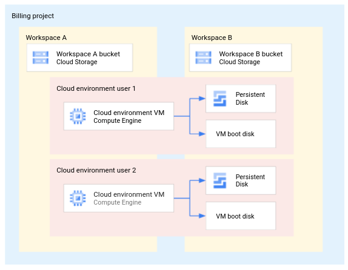


The relationships between the key components are as follows (additional information is [here](https://support.terra.bio/hc/en-us/articles/360058163311-Understanding-the-Terra-ecosystem-and-how-your-files-live-in-it)):


*   A billing project can consist of zero, one or more workspaces
*   A workspace has one workspace bucket. The workspace bucket is a [Google Cloud Storage](https://cloud.google.com/storage) bucket.
*   As a user you can have zero or one cloud environments in a billing project (other users may have separate cloud environments in the billing project as well)
*   Your cloud environment in a billing project supports zero, one or more workspaces in the billing project
    *   **All of Us Workbench**. You can have only one workspace for each billing project.
*   A cloud environment has a persistent disk, and zero or one Compute Engine instance (a VM with a boot disk - here shown separately for clarity). The term Compute Engine instance and VM instance are used interchangeably. A cloud environment can be a [Spark cluster](https://support.terra.bio/hc/en-us/articles/360038125912-Understanding-and-adjusting-your-Cloud-Environment) as well, and in this case the master as well as worker nodes have their own disks, but there is no separate persistent disk.

A persistent disk might be removed by you (intentionally or accidentally) even though you are not yet done with your work. In this case you have to recreate the data on the persistent disk, and the section on system setup later shows how this is accomplished by you.

> **All of Us Workbench**. Your persistent disk is deleted when your cloud environment is periodically deleted by the system.

While the VM, its boot disk, and the persistent disk in your cloud environment are accessible only by you, the workspace bucket is accessible by every user that has access to the workspace. Any data that you do not want to share you have to keep in the persistent disk (or the Compute Engine instance boot disk – which is not a good practice as it is deleted every time the Compute Engine instance is deleted and recreated).

The different storage systems have different life cycles:

*   **Workspace bucket**. The workspace bucket is created with the workspace, and is deleted when the workspace is deleted.
*   **Persistent disk**. The persistent disk is created with the first cloud environment. If you intentionally delete it when you at the same time delete your cloud environment, a persistent disk is created when you create a cloud environment again. Any data that was on the persistent disk before deletion is lost.
*   **VM boot disk**. The boot disk of a Compute Engine instance has the exact same life cycle as the Compute Engine instance: it gets created with the Compute Engine instance, and deleted once the Compute Engine instance is deleted. Any data on a boot disk is lost when the Compute Engine instance is deleted. It is best practice to not store data on the boot disk that you cannot completely recreate.

The workspace bucket exists as a storage location independent of Compute Engine instances and persistent disks. In order for you to ensure that your data does not get lost with the deletion of a cloud environment and/or persistent disk, you can always backup your data to the workspace bucket. However, as already stated, be aware that the workspace bucket is shared among and accessible by all users that have access to the workspace.

To see the list of cloud environment that you have created, go to https://app.terra.bio/#clusters.


#### Current workspace architecture

According to [Moving to a project-per-workspace model for improved resource management](https://terra.bio/moving-to-a-project-per-workspace-model-for-improved-resource-management/) the architecture changes so that each workspace has a dedicated Google Cloud project in a 1:1 relationship. This means that a Cloud Environment is dedicated to a workspace as well and not shared between workspaces anymore.

The following diagram shows the change.

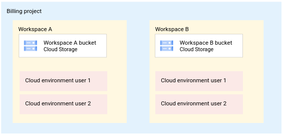


This depicts the same situation of the architecture above: as user 1 you have to create two cloud environments, one in each workspace, in order to conduct work in both workspaces.


#### Deleting a workspace

Note that when you delete a workspace in the former architecture, a cloud environment that you created in the corresponding billing project will not be deleted automatically, you have to delete it manually by looking it up in the list of cloud environments.

In the current architecture, when you delete a workspace, the underlying Google Cloud project is deleted. However, you will continue to see the cloud environment that you created. While the resources are freed up in Google Cloud, the table entry in the list of cloud environments is not. For the time being, you can navigate to the list of cloud environments and delete the cloud environment as well as the persistent disk yourself by selecting the trash can icon.


### Exploring the workspace bucket

The following instructions show you how to access the workspace bucket.

**All of Us Workbench**. You do not have access to the Google Cloud Cloud console. Explore your workspace bucket instead using [gsutil](https://cloud.google.com/storage/docs/gsutil).

1. Open a workspace

2. If not already on the **DASHBOARD** tab, click on **DASHBOARD**:

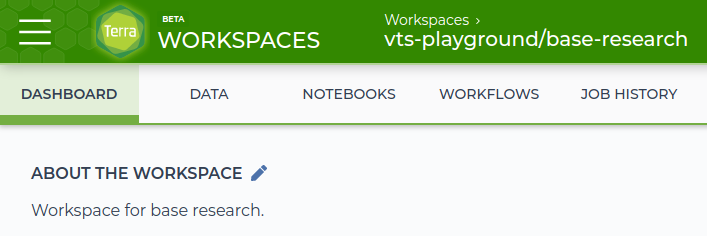

3. In the lower right corner in the Google Bucket section, click on **Open in browser**:

   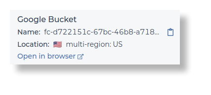

<!-- Note that the bucket is a [multi-region](https://cloud.google.com/storage/docs/locations) bucket, by default, providing geo-redundancy. In the future a feature might be added to place buckets into specific user-selectable regions. -->

4. The Google Cloud Platform Cloud Console opens and shows the workspace bucket in GCS including any objects stored in the bucket. In your environment you might observe different content from what is shown here.

   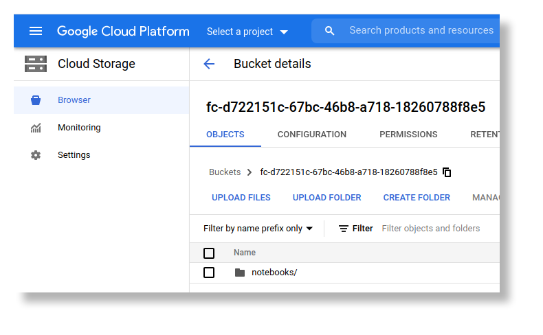


The next section shows you how to access the **persistent disk**.


### Exploring the persistent disk

In the following, you create a cloud environment and access the persistent disk. The persistent disk is available at a specific directory location (mount location) from the boot disk.  Specifically, it is [mounted at `/home/jupyter`](https://support.terra.bio/hc/en-us/articles/360047318551-Detachable-Persistent-Disks-#h_01EZD0WYEBPFBB87M3NEM44MW3).

When you delete the cloud environment (and not the persistent disk) and recreate it, the persistent disk is available in the same directory location after recreation.

1. Open a workspace
2. Create a cloud environment if you do not have one by clicking on the blue play triangle

   

3. On the next screen, click **CREATE**. This creates a default environment. For an in-depth discussion of options and customizations, see [here](https://support.terra.bio/hc/en-us/articles/360038125912-Understanding-and-adjusting-your-Cloud-Environment).
4. Observe that the cloud environment is being created:

   

5. Once created, the status changes to running:

   

At this point you have a running cloud environment consisting of a VM, a boot disk and a persistent disk. To access the boot disk, follow these steps:

1. Click on the square blue terminal icon:

   

    **All of Us Workbench**: Your icon for opening the terminal looks like this:
    

2. A separate browser tab opens with a terminal running in it:

   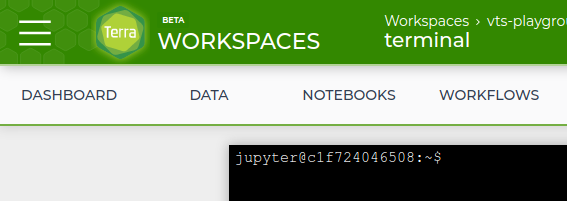

3. Type the following commands to change to the home directory of the user `jupyter` and to show the directory path:
   ```sh
   cd
   pwd
   ```

4. The result of these commands shows in the terminal as follows:

   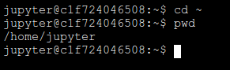

5. Type the following command:
    ```sh
    ls -al
    ```

6. This shows the contents of the user’s home directory, `/home/jupyter`, where the persistent disk is mounted. You will see a subdirectory with your workspace name *after* you have initiated notebook edits (not shown in the screenshot below). This is where your notebook files live on the PD, [synced with your workspace bucket](https://support.terra.bio/hc/en-us/articles/360047318551-Detachable-Persistent-Disks-#h_01EZD0Y224MPZMZ4XCP3K64RKV).

   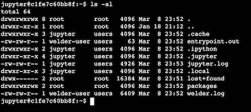


7. The following command changes the terminal to the root directory of the **boot disk**, under which the persistent disk is mounted:
    ```sh
    cd /
    ```
    With the following command, you can show all top level directories and files:
    ```sh
    ls -al
    ```

At this point you have explored the workspace bucket, and the persistent disk mounted as a subdirectory of the boot disk.

### Persistent disk availability

Since a persistent disk can be deleted, the instructions later in the document cover how to recreate the contents of a persistent disk using GitHub.

The next section describes the relationship between GitHub and Terra in order to establish the overall architecture for reference later in this document.


## Workspace deployment architecture: relationship with GitHub

[GitHub](https://github.com/) is a widely used source control system. While other systems are available as well, this solution focuses exclusively on the best practices for GitHub.


### Former workspace architecture

The following diagram shows possible relationships between the Terra architecture and GitHub in the former workspace architecture.


The following relationships exist:

*   Your cloud environment can be related to zero, one or more GitHub repositories
*   A GitHub repository can be related to zero, one or more cloud environments

As you'll see later on, the relationship manifests itself by source code being managed on the persistent disk and being synchronized with GitHub projects. Managing content on the Compute Engine instance’s boot disk (in your cloud environment) is not recommended and this case is not covered in this solution.

An important architectural aspect to point out is that GitHub and Terra are two independent systems. This means that their storage, their management, their authentication and authorization settings are independent of each other.

You must manually manage the relationship between a Terra cloud environment and a GitHub repository. This section documents the major use cases you might encounter.


### Current workspace architecture

Since the current workspace architecture has a cloud environment for each workspace, the diagram changes to the following.

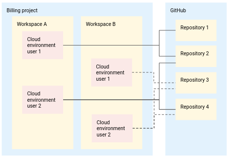

Each cloud environment has to establish a relationship with GitHub. If the same user works in two workspaces, the relationship has to be established for both.

## Notebooks architecture


### Architecture overview

This section discusses the notebook architecture as it relates to storage from the viewpoint of source control. A complete discussion of all aspects around notebooks are here: [Terra's Jupyter Notebooks environment Part I: Key components](https://support.terra.bio/hc/en-us/articles/360027237871-Terra-s-Jupyter-Notebooks-environment-Part-I-Key-components) and here: [Terra's Jupyter Notebooks environment Part II: Key operations](https://support.terra.bio/hc/en-us/articles/360027083172-Terra-s-Jupyter-Notebooks-environment-Part-II-Key-operations).

There are different actions you can take on a notebook:

*   **Create a notebook**. The created notebook is stored in the workspace bucket in the subdirectory called notebooks.
*   **Edit a notebook**. When you edit a notebook, several actions take place:
    1. The notebook is copied from the workspace bucket to the persistent disk. The directory is: `/home/jupyter/<workspace-name>/edit` , where `<workspace-name>` is the name of your workspace.
> **All of Us Workbench**. In your case the directory is `/home/jupyter/workspaces/<workspace-name>`
    1. The notebook opens in the browser window
    2. The notebook is automatically saved every 5 seconds to both locations, the workspace bucket and the persistent disk

*   **Save a notebook**. When you save a notebook its state is saved to the workspace bucket and the persistent disk.
*   **Delete a notebook**. When you delete a notebook, it is deleted from the workspace bucket but not from the persistent disk. Best practice is to delete it manually from the persistent disk as well.

### Exploring the storage locations of notebooks

The following instructions guide you to the storage location of notebooks. Take the time to explore those as understanding those is important for the various use cases of source control later.

1. Open a workspace and create or start a cloud environment
2. Once the cloud environment is running, navigate to the **NOTEBOOKS** tab

   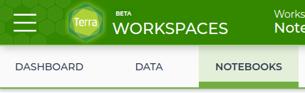

3. On the left side, click on **Create a New Notebook** and follow the instructions.

   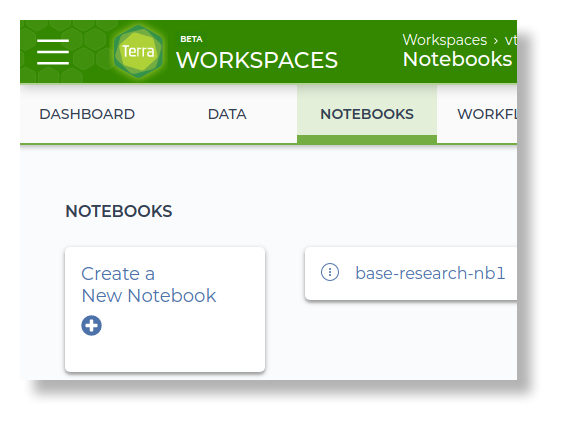

Navigate to the workspace bucket to see that the notebook is stored in it:

1. Click on **DASHBOARD**
2. In the lower right corner, click on **Open in browser**
3. The Cloud Console opens showing the workspace bucket
4. Click on the folder **notebooks/**

   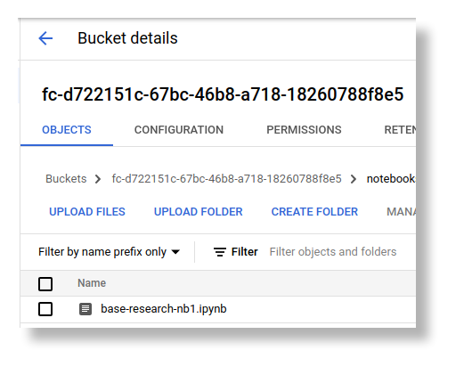

5. Observe that the notebook you created is present in the **notebooks/** folder

> **All of Us Workbench**: You do not have access to the Google Cloud console. Explore the **notebooks/** folder of your workspace bucket using [gsutil](https://cloud.google.com/storage/docs/gsutil) instead.

At this point the notebook is created, present in the workspace bucket, and not yet on the persistent disk.

1. Click on the tab **NOTEBOOKS**
2. Click on the circle with the three vertical dots and when the menu opens, click **Edit**
3. The notebook opens and shows a first cell:

   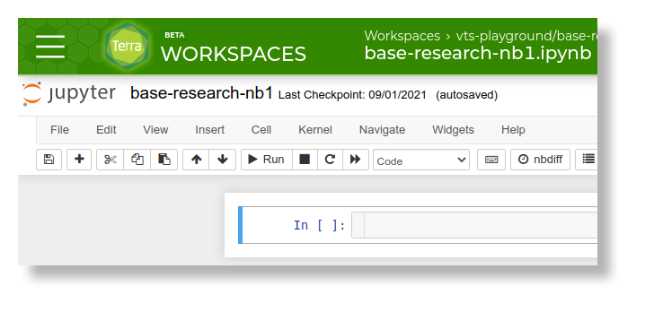
4. Select the browser tab with the running terminal and execute the command
    ```sh
    ls
    ```

5. Compared to earlier, observe that a subdirectory was created in the persistent disk that has the name of your workspace (`aju-Terra-Data-Tables-Quickstart` in the screenshot below):

   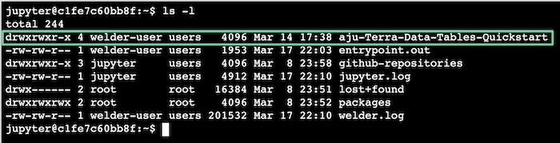

6. Execute the commands:
    ```sh
    cd <workspace-name>/edit
    ls
    ```

7. The terminal shows:

   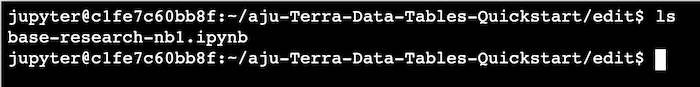

8. Observe that the notebook is now present on the persistent disk as well. As soon as you clicked **Edit** the system copied the notebook from the workspace folder to the persistent disk.


### Persistent disk contents recreation

When you delete your persistent disk its contents are gone. However, since the autosave functionality has saved the notebooks in the workspace bucket, your notebooks are not lost.

Once you recreate the cloud environment and with it a persistent disk, the notebooks are copied to the persistent disk once you edit any notebook. From this moment on all notebooks are available in the persistent disk again. However, no other content that you might have had on the persistent disk before its deletion is automatically recreated.

### Private notebooks

Since your notebook (or several notebooks) are automatically synchronized to the workspace bucket, all users that can access the workspace can see your notebooks. If you want to manage notebooks so that they are not automatically synchronized to the workspace bucket, you need to store those in a separate directory on the persistent disk that has a name different from a workspace name as outlined here: [Detachable Persistent Disks – Terra Support](https://support.terra.bio/hc/en-us/articles/360047318551-Detachable-Persistent-Disks-) in section “A note about auto-syncing behavior”.

In order to access a notebook that you created in a separate directory, follow these steps:

1. Open a regular notebook
2. Click on the Jupyter icon:

   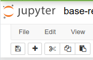

3. Once you click on the Jupyter icon, a directory browser with the content of the persistent disk is displayed:

   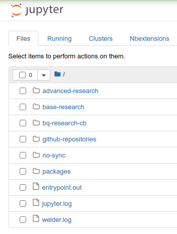


4. In this example, the directory containing private notebooks was created with the name `no-sync` (you can choose your own name)
5. When you click at your directory containing private notebooks, the directory contents are displayed:

   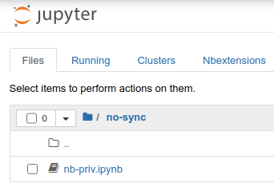

6. Click on the notebook you want to edit and it opens another browser tab displaying the Jupyter notebook.


### Creating notebooks by copying into edit/ folder

It is possible to place a notebook directly into the `edit/` folder. Initially, the workspace does not recognize this as a known notebook since it was not created using the create dialog in the **NOTEBOOK** tab.

> **All of Us Workbench**: The folder is `/home/jupyter/workspaces/<workspace-name>`

However, Terra repairs this situation automatically. If you open the new notebook using the same approach as for private notebooks (navigating to the `edit/` folder), the following message is displayed:
   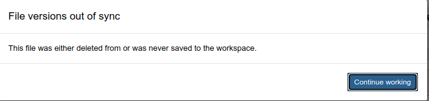


Once you click on **Continue working** and then save the notebook, the notebook is recognized by Terra as a regular notebook and saved to the workspace bucket. It is also listed in the list in the **NOTEBOOK** tab at this point.


## Basic source control processes

This document assumes that you have a basic understanding of source control and Git. The discussion in this section is not a complete tutorial and only highlights a few key concepts and processes in order to establish a common understanding and terminology in this document.

There are many primers available on the Internet, for example, [Learn Git- Git tutorials, workflows and commands](https://www.atlassian.com/git) or this Git [book](https://git-scm.com/book/en/v2). If you are not familiar with source control, especially using GitHub, please search for and find a primer and tutorials that fit your style of learning – it helps you to understand the content of this solution document.

While [Git](https://git-scm.com/) is a source control system, [GitHub](https://github.com/) is a web hosted version of Git. Here we assume that you are using GitHub and are not maintaining Git yourself. However, even if you do, the use cases and their implementation remain the same.

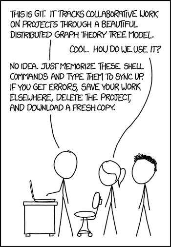

[from: xkcd.com: Git](https://xkcd.com/1597/)


### Git and GitHub

As already mentioned GitHub is a web-based version of Git and makes Git’s functionality accessible without having you to maintain a Git deployment yourself. Another implementation of Git is [Bitbucket](https://bitbucket.org/), for example. Git has documented its functionality in a [book](https://git-scm.com/book/en/v2). This is a helpful reference for you to remember.

This solution uses GitHub to implement the various use cases that you might encounter. A discussion of user journeys as well as
individual use cases is discussed separately in [Part III](./terra_source_control_III.md) of this series.

The use cases show how to interact with GitHub using the Git commands in a terminal. Each use case is a set of step-by-step instructions for you to follow in order to execute a use case.

The next sections introduce the main concepts as a refresher as those are referred to by the use case instructions.


### Artifacts and repositories

As outlined above in [Workspace deployment architecture: relationship with GitHub](#workspace-deployment-architecture-relationship-with-github) your cloud environment can refer to zero, one or more repositories, and a repository can be referred to by zero, one or more cloud environments.

All artifacts in a repository are one unit from the viewpoint of source control. Ideally you manage all artifacts that belong together in the same repository. However, you can decide to store the artifacts of a workspace into different repositories. Neither Terra nor GitHub prevent you from a different organization of your artifacts. For example, if your workspace has several notebooks, you could manage those in one or several repositories.

If you work on your own, and do not share any of your work, the artifacts of a workspace that you source control are in a repository that is only related to your cloud environment. In this case it is a 1:1 relationship between your cloud environment and the repository. You can also have several repositories, each in a 1:1 relationship (one repository for each workspace).

If you collaborate with others, you share artifacts through a repository that is related to the cloud environments of all your collaborators. In this case it is a n:1 relationship where one repository is referred to by many cloud environments. You are not restricted to referring only to one repository: your cloud environment can refer to as many repositories since you can work in many workspaces with your cloud environment.

In practice you have one subdirectory on your persistent disk for each repository you refer to. This ensures that you can work on those different artifacts of the different workspaces strictly separated and avoid any accidental changes.


### Local and remote branches

One of the key concepts of Git is the notion of a branch. All artifacts of a repository are in at least one branch.

*   **Local branch**. A local branch refers to the branch of a remote repository in your local environment, like a laptop or a persistent disk. The local environment is referred to as a local repository.
*   **Remote branch**. The remote branch refers to the branch of a remote repository in the GitHub system.

In order to change an artifact, you download the remote repository to your local environment, make the changes you want, commit the changes and then upload your locally committed changes to the remote repository. Once uploaded, the content of the remote repository is visible to any collaborators that share the repository as well. The repository in your local environment is also called local repository.

This downloading and uploading is accomplished by executing several Git commands that ensure that all communication and all changes are consistent and do not compromise the integrity of a repository.

By default when creating a repository a default branch called main is created. All artifacts that you add to the repository are in this branch.

It is possible for you to create additional branches. When you create a new branch then this makes the artifacts available in the new branch as well. The two branches are independent and so you can change the same artifact in both branches in different ways, effectively creating variants of the artifact. This helps explore different approaches in your work. Once you determine which of the variants should be the version going forward, you can reconcile the changes you want to keep back into the main branch and remove the second branch. How to execute this use case is discussed later.


### Basic source control processes

In general there are a few basic source control processes that you execute:

*   **Working by yourself**. One basic scenario is that you are working by yourself for the duration of your project without sharing or collaborating with other team members or researchers from different organizations. When you work by yourself you have a remote GitHub repository and work with local branches of that repository in your environment. You use GitHub as the remote system that has your artifacts for the reasons discussed in
[Why source control?](#why-source-control).
*   **Collaborating with others**. A different scenario is collaborating with others in a project. In this scenario you use the remote GitHub repository or repositories as a common repository that all collaborating members share. Each collaborator works on the various artifacts locally in local branches and synchronizes the work with the remote repository so that other collaborators can see and incorporate the changes into their local branches. In this case there is over time a constant synchronization between the local and remote branches ensuring consistent progress.
*   **Initially creating an artifact**. In some cases you are the initiator of a project, and you start creating artifacts as there are no artifacts created yet. In this case you create a remote repository, create the artifact locally and perform a first synchronization from your local to the remote repository. You might then work by yourself or invite collaborating team members over time.

There is the case that when you start a project, you copy one or several artifacts from other projects, or previous work, or artifacts provided by a data provider as a starting point. Those become your initial artifacts and have no relationship to their origin location anymore since you copied those. Changes to those are not incorporated back into the original location or projects where you copied them from. Instead, you create a repository or add those to an existing repository.

All these processes and the detailed use cases are explained later in the form of step-by-step instructions on a terminal command line.


### Merge conflicts and conflict resolution

It is possible that you and a collaborator of yours change the same artifact in their local branch and these changes might be in conflict with each other. If your collaborator synchronizes with the remote repository before you, you get a merge conflict when you try to synchronize with the remote repository as well.

In this case you have to resolve the conflicts by deciding for each conflict how to resolve it. This is basically requiring you to decide if your code, or the collaborators code, or an entirely different approach is correct. There is documentation available on how to deal with merge conflicts, for example, [Basic Branching and Merging](https://git-scm.com/book/en/v2/Git-Branching-Basic-Branching-and-Merging#_basic_merge_conflicts) and [7.8 Git Tools - Advanced Merging](https://git-scm.com/book/en/v2/Git-Tools-Advanced-Merging).


### Reverting changes

Every now and then you make changes to an artifact, and it turns out that you rather want to go back to a previous version and start over from a previous version. This is supported by Git and depending on the specific circumstances different approaches are available, see here for one of many discussions: [Git - Undoing changes](https://www.atlassian.com/git/tutorials/undoing-changes).


### Source control commands

This solution guides you through the initial system setup, the re-creation of a previous setup after a cloud environment restart or deletion, as well as all source control use cases with step-by-step instructions on the terminal command line. This ensures that you can completely see and understand how all these various aspects are accomplished.

Next: [Best practices for source control on Terra, Part II: Work Environment](terra_source_control_II.md).


# References

*   [Terra](https://terra.bio/) and the [Terra system](https://app.terra.bio/)
*   [Detachable Persistent Disks – Terra Support](https://support.terra.bio/hc/en-us/articles/360047318551)
