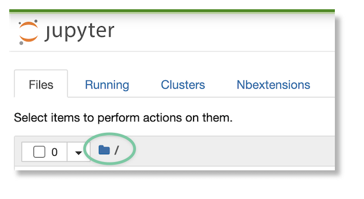
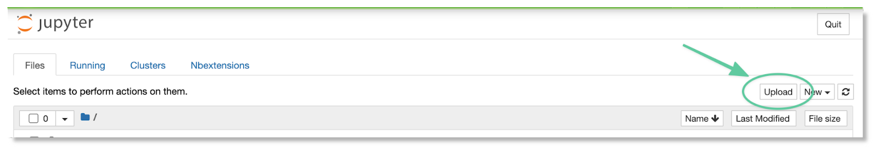
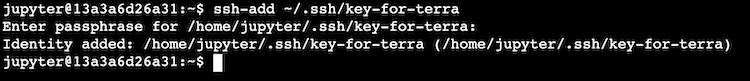
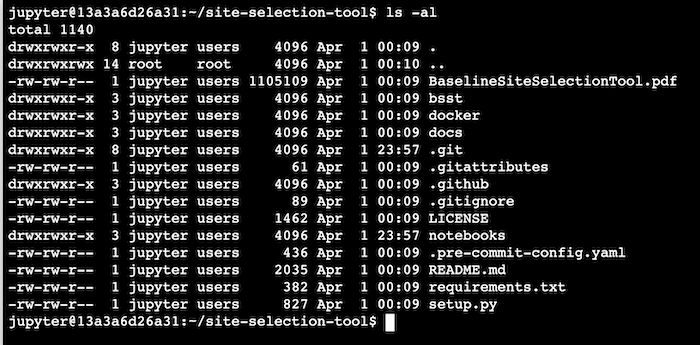
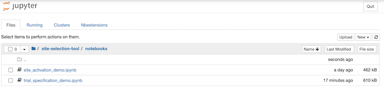
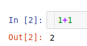
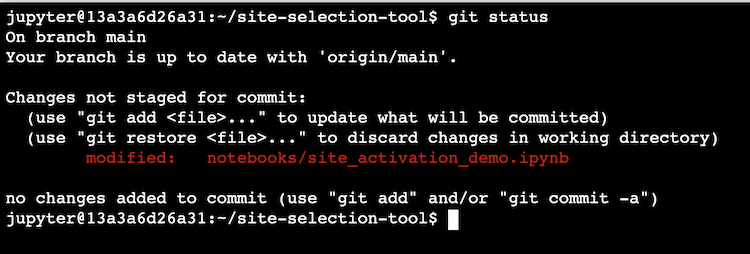
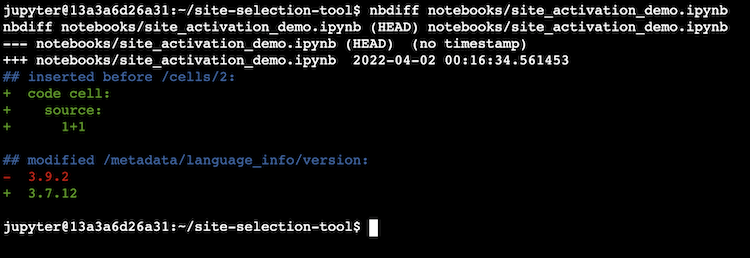
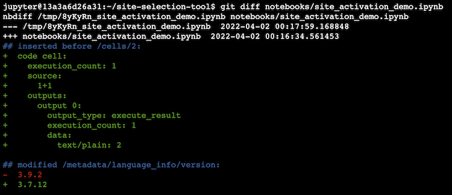

# Best practices for source control on Terra, Part II: Work Environment

<!-- ## Author: cbussler@, jtbates@, amyu@ \
Last Updated: 30/03/2022 -->

- [Best practices for source control on Terra, Part II: Work Environment](#best-practices-for-source-control-on-terra-part-ii-work-environment)
- [Introduction and Scope](#introduction-and-scope)
- [Objectives](#objectives)
- [Work environment: Terra workspace and GitHub](#work-environment-terra-workspace-and-github)
  - [Setting up all parts of your work environment](#setting-up-all-parts-of-your-work-environment)
    - [Overall deployment architecture](#overall-deployment-architecture)
  - [Create your SSH keys on your laptop or desktop computer](#create-your-ssh-keys-on-your-laptop-or-desktop-computer)
  - [Set up your SSH key on your cloud environment’s persistent disk](#set-up-your-ssh-key-on-your-cloud-environments-persistent-disk)
    - [Upload your private ssh key](#upload-your-private-ssh-key)
    - [Add your key to the `ssh-agent`](#add-your-key-to-the-ssh-agent)
    - [Restart your ssh-agent after a cloud environment restart](#restart-your-ssh-agent-after-a-cloud-environment-restart)
    - [Add your public ssh key to your GitHub account](#add-your-public-ssh-key-to-your-github-account)
  - [Test authentication](#test-authentication)
  - [Git setup](#git-setup)
  - [Setup of notebook diff and cell output removal tools](#setup-of-notebook-diff-and-cell-output-removal-tools)
  - [Clone a first GitHub repository](#clone-a-first-github-repository)
    - [**Clone the repository**](#clone-the-repository)
    - [Modify a notebook](#modify-a-notebook)
    - [Determine the status of your local repository](#determine-the-status-of-your-local-repository)
    - [Explore notebook diffs with `nbdime`](#explore-notebook-diffs-with-nbdime)
    - [Cleanup](#cleanup)
  - [Restore after cloud environment and persistent disk deletion](#restore-after-cloud-environment-and-persistent-disk-deletion)
    - [Restoring a local repository from GitHub](#restoring-a-local-repository-from-github)
  - [What’s next?](#whats-next)
- [References](#references)

# Introduction and Scope

The previous document in this series, [Best practices for source control on Terra, Part I: Background](./terra_source_control_I.md), provided some background on Terra and source control concepts.

This document describes best practices for source code control in [Terra Workspaces](https://app.terra.bio/) for artifacts like [notebooks](https://support.terra.bio/hc/en-us/articles/360059009571-Notebooks-Quickstart-Guide),
Python and R packages, or [workflows](https://support.terra.bio/hc/en-us/articles/360034701991-Pipelining-with-workflows). The goal of this solution is to enable you to manage, share and collaborate on artifacts effectively using the source code control system [GitHub](https://github.com/). In the following we use the term “source control” for brevity.

The initial focus is on source controlling notebooks and not on other artifacts like workflows. Those are discussed separately at a later point in time. Source controlling notebooks is a major predominant use case and will have the biggest benefit for Terra users (including All of Us Workbench users).

> **All of Us Workbench**: The All of Us workbench differs from the general [Terra.bio](https://app.terra.bio/) system in a few areas. These differences are called out throughout this document so that it applies to the All of Us workbench as well.

The best practices do not discuss the management of data like workspace tables, reference data, samples in buckets, tables in BigQuery, or any other data - the discussion is focused on code only.

# Objectives

Reading this document and executing the commands provide you with the required knowledge and toolset to:

*   Learn to use source control for notebooks
*   Learn to prepare your Terra cloud environment and reinitialize it after its restart or its recreation
*   Learn about the Terra workspace deployment architecture and understand the various storage systems involved
*   Learn about several source control user journeys and the use cases that enable them

# Work environment: Terra workspace and GitHub

## Setting up all parts of your work environment

This section guides you through the initial setup of the Terra workspace cloud environment to use GitHub as the source control system. In addition, it discusses how to recover the cloud environment after the deletion of your persistent disk.

### Overall deployment architecture

Several systems are involved in setting up your environment. These include:

*   **Laptop/desktop**. This system is used to create and manage SSH keys. The reason for this is that it is possible to delete your Terra cloud environment completely: if you manage keys in the cloud environment – which is possible – you would have to recreate the SSH keys when the cloud environment is deleted, and you would have to update your GitHub account settings with the new keys. It is a lot easier and requires less effort to manage the SSH keys on your laptop or desktop and recover those from it as necessary.
*   **Persistent disk**. The persistent disk holds all the artifacts that are source controlled (e.g., notebooks, workspace description, workspace metadata, workflows and packages). It is a best practice to have one subdirectory for each GitHub repository that you are interacting with on the persistent disk. Effectively this means that the artifacts of each workspace you work on is in a separate subdirectory. When the cloud environment is deleted and recreated, the persistent disk is unchanged and your data is preserved. It also contains required configuration files that are referred to by the boot disk using commands to read those.
*   **Boot disk**. While the persistent disk holds all your artifacts, the boot disk needs configuration information related to GitHub in order to execute any Git command properly. The best practice is that all required data is stored on the persistent disk, and from there made available to the appropriate directory location on the boot disk. If the cloud environment is recreated, the configuration information must only be made available to the boot disk again by you without the need for recreating it, as it is stored on the persistent disk.
*   **GitHub**. GitHub holds the artifacts that you want to put under source control as well as the public SSH key so that secure and authenticated communication is possible between the cloud environment and GitHub. You configure GitHub with the SSH keys that you generate on your laptop.

In the following you create all directories, keys, and configurations required to source control your artifacts.

Note: the following assumes that you have a GitHub account set up. If not, follow these instructions to create an account: [Signing up for a new GitHub account](https://docs.github.com/en/get-started/signing-up-for-github/signing-up-for-a-new-github-account). It might be that your organization has one set up for you already, or that it has specific requirements for how to set up a GitHub account.


## Create your SSH keys on your laptop or desktop computer

In order to securely communicate with GitHub the best strategy is to use SSH, as discussed in this document: [Github "About SSH"](https://docs.github.com/en/github/authenticating-to-github/connecting-to-github-with-ssh/about-ssh). Aside from the secure communication, it makes the interaction more efficient as when using SSH you do not have to constantly type in your user name and password to authenticate yourself to GitHub.

SSH is not the only approach to authentication in the context of GitHub: [About authentication to GitHub](https://docs.github.com/en/github/authenticating-to-github/keeping-your-account-and-data-secure/about-authentication-to-github); however, the alternatives are not discussed here.

On your local machine, follow the process described in this GitHub doc:  [Connecting to GitHub with SSH](https://docs.github.com/en/github/authenticating-to-github/connecting-to-github-with-ssh).

You may want to[ check for existing SSH keys](https://docs.github.com/en/github/authenticating-to-github/connecting-to-github-with-ssh/checking-for-existing-ssh-keys). If you want to create a new key, follow these instructions: [Generating a new SSH key and adding it to the ssh-agent](https://docs.github.com/en/github/authenticating-to-github/connecting-to-github-with-ssh/generating-a-new-ssh-key-and-adding-it-to-the-ssh-agent).

At this point in your setup, you have a private and a public key. You transfer the private key to the persistent disk and add it to the ssh-agent in the cloud environment. You add the public key to your GitHub account. The instructions follow next.

The following sections assume that your private key file is named `key-for-terra`.
**Edit the commands below before running them if your filename is different**.


## Set up your SSH key on your cloud environment’s persistent disk


### Upload your private ssh key

The next step is to copy your private ssh key from your laptop or desktop to the persistent disk.


1. Create a `.ssh` directory in your $HOME directory, and set its permissions so that only you can view it.  In the terminal window, run:
   ```sh
   cd; mkdir -p ~/.ssh;chmod 700 ~/.ssh
   ```
2. Upload your private key to your $HOME directory via the Jupyter UI.
   Open an existing notebook in the tab **NOTEBOOKS** (preferably in **PLAYGROUND MODE**). If you do not have one already, create one as at least one is required for accessing the notebooks in the local repository.
   Click on the Jupyter logo to open the file browser.

   

   Click on the “folder” icon to navigate to` /home/jupyter `(this is the default directory when you first open this view).

   
   From the file browser, click “Upload” to upload your private key.

   

   > **Tip**: On MacOS, in the ‘File Open’ dialog, do `cmd-shift-`. to display dot files in the dialog window.  This is useful to navigate to a .ssh directory on your laptop or desktop machine.

3. In the terminal window, run the following command to move your uploaded key file from $HOME to the .ssh directory, and make it readable only to you.   Edit the following first if your key file has a different name:
   ```sh
   mv key-for-terra ~/.ssh; chmod 600 ~/.ssh/key-for-terra
   ```


### Add your key to the `ssh-agent`

At this point the private key is available in the cloud environment. The next step is to add it to the `ssh-agent`.

This simplifies interactions with GitHub. Add the private ssh key to the `ssh-agent` as follows.

1. If you have not already done so, start the ssh-agent:
    ```sh
    eval $(ssh-agent -s)
    ```
    This returns a `pid`, for example,
    ```
    Agent pid 80
    ```

2. Add the private key to the ssh-agent. (Edit this command before running it if your key has a different name).
    ```sh
    ssh-add ~/.ssh/key-for-terra
    ```

3. The command prompts you for the passphrase for the private key.
4. Enter the passphrase that you used when you created the ssh key:

   

5. Check that the key was added to the agent by executing:
    ```sh
    ssh-add -l
    ```

   

At this point the `ssh-agent` is set up.

### Restart your ssh-agent after a cloud environment restart

If you restart your cloud environment, you will need to restart your` ssh-agent` and re-add your key.  Open a terminal window and execute the following commands again:


```sh
eval $(ssh-agent -s)
ssh-add ~/.ssh/key-for-terra
```

### Add your public ssh key to your GitHub account

If you haven’t done so already, add your public ssh key to your GitHub account as described in: [Adding a new SSH key to your GitHub account](https://docs.github.com/en/github/authenticating-to-github/connecting-to-github-with-ssh/adding-a-new-ssh-key-to-your-github-account).


## Test authentication

At this point, the setup of the ssh key is completed and what is left is for you to test that the authentication works.

This process [GitHub: Testing your SSH connection](https://docs.github.com/en/github/authenticating-to-github/connecting-to-github-with-ssh/testing-your-ssh-connection) shows how to test that the ssh connection is working between the cloud environment and GitHub.

**Note**: make sure that you run the test from the terminal of your cloud environment, not from a terminal on your laptop or desktop, as all GitHub interaction will take place from your cloud environment.


## Git setup

`git` is already installed in the default cloud environment.  If you are using a custom container, you may need to install it first.

1. Set your name and email for git to use. Feel free to change the content of the user.name to your real first and last name
    ```sh
    git config --global user.email "$OWNER_EMAIL"
    git config --global user.name "$OWNER_EMAIL"
    ```

2. Test that the configuration worked. This configuration is stored in `$HOME/.gitconfig`.
    ```sh
    git config --global --list
    ```

Once git is available and the configuration established, you can continue with the next set of setups.

> Note: It is possible to configure git command completion (using the tab key on the keyboard) with the following command (if this is available on your machine):
```sh
  source /usr/share/bash-completion/completions/git
```

A discussion for different environments as well as alternative setups are here: [How to configure git bash command line completion?](https://stackoverflow.com/questions/12399002/how-to-configure-git-bash-command-line-completion).


## Setup of notebook diff and cell output removal tools

When working with notebooks you will find two tools very helpful for your daily work:


*   **Jupyter diff tool**. A diff tool that is aware of it being used for Jupyter can display notebook diffs in a more structured way compared to tools that solely show you a diff based on the textual representation of a notebook.
*   **Cell output removal tool**. A tool that removes cell outputs automatically when you commit changes to GitHub helps ensure that sensitive data is not made available in GitHub.

In the following you will install [nbdime](https://nbdime.readthedocs.io/en/latest/)(**n**ote**b**ook **di**ffing and **me**rging) as the diff tool, and [nbstripout](https://pypi.org/project/nbstripout/) as the cell output removal tool.

1. Open a workspace with a running cloud environment. If you do not have a running cloud environment, start it
2. Open a terminal window
3. Execute the following command that installs both tools into the cloud environment

    ```sh
    pip3 install --upgrade nbdime nbstripout
    ```
    If you receive a suggestion similar to the following, upgrade pip right away and run the previous command again:
    ```
    WARNING: You are using pip version 21.1.3; however, version 21.2.4 is available.
    You should consider upgrading via the '/opt/conda/bin/python3.7 -m pip install --upgrade pip' command.
    ```

4. To check the successful installation, run the following
    ```sh
    nbdime --version
    nbstripout --version
    ```

5. The command might produce significant installation output and might contain the following error message (depending on your environment and the precise version you install) that you can safely ignore:

    ```
    ERROR: pip's dependency resolver does not currently take into account all the packages that are installed. This behaviour is the source of the following dependency conflicts
    tensorflow 2.4.2 requires grpcio~=1.32.0, but you have grpcio 1.38.0 which is incompatible.
    tensorflow 2.4.2 requires six~=1.15.0, but you have six 1.16.0 which is incompatible.
    tensorflow 2.4.2 requires typing-extensions~=3.7.4, but you have typing-extensions 3.10.0.0 which is incompatible.
    jupyterlab-git 0.11.0 requires nbdime<2.0.0,>=1.1.0, but you have nbdime 3.1.0 which is incompatible.
    ```


6. The following command turns on `nbdime` for all GitHub repositories:
    ```sh
    nbdime config-git --enable --global
    ```
   You might see an ignorable error similar to the following:

  ```sh
    /opt/conda/lib/python3.7/site-packages/jupyter_server_mathjax/app.py:40: FutureWarning: The alias `_()` will be deprecated. Use `_i18n()` instead.
      help=_("""The MathJax.js configuration file that is to be used."""),
  ```


7. You can set up `nbstripout` as a git filter in your global `~/.gitconfig `like this:
    ```sh
    nbstripout --install --global
    ```
   If you later want to remove the filter, run: `nbstripout --uninstall --global`.


At this point the two tools are installed and enabled for all GitHub repositories.

> Note: when you open a notebook in edit mode you will see a UI control labeled **nbdiff**.
>
  

  This control is not related to the `nbdime` tool that you just installed, and is not currently functional. In the following this is ignored and not further discussed.


## Clone a first GitHub repository

After you’ve finished setup and configuration, try cloning a GitHub repo.

The next set of instructions will guide you through one example of how to use Git and GitHub. With the following commands you:

*   Clone an existing repository containing several notebooks
*   Open one notebook and modify it
*   Use the nbdime to observe a diff after modifying a notebook
*   Observe that cell outputs are stripped out by nbstripout

This example gives you a first impression on the process as well as tools involved in the process.  We’ll use this repository for the example: https://github.com/verilylifesciences/site-selection-tool/.


### **Clone the repository**

The first step is to clone [the repository](https://github.com/DataBiosphere/terra-example-notebooks). This section assumes that you have set up the environment as described in the previous sections of this document.

1. Open a workspace with a running cloud environment. If you do not have a running cloud environment, start it.
2. Open a terminal window
3. Execute the following command.  You can run the command from your `$HOME` directory, or if you like, you can create a subdirectory under `$HOME` for GitHub repos and change to that directory first.
    ```sh
    git clone git@github.com:verilylifesciences/site-selection-tool.git
    ```

4. If you see the following error, you need to set up the` ssh-agent` again.
    ```sh
    git@github.com: Permission denied (publickey).
    fatal: Could not read from remote repository.
    Please make sure you have the correct access rights and the repository exists.
    ```
   The commands for setting up the ssh-agent are:
    ```sh
    eval $(ssh-agent -s)
    ssh-add ~/.ssh/key-for-terra
    ```
   You will have to enter your passphrase at the prompt of the last command.

5. Observe via `ls` that a new directory is created called `site-selection-tool.` Navigate into the directory:
    ```sh
    cd site-selection-tool
    ls -al
    ```

  
  Observe a directory called `.git`: this indicates that this is the local version of a remote repository

6. Execute the following Git command:
   ```sh
   git remote -v
   ```
This shows you the location of the remote repository in GitHub:

<p id="gdcalert9" ><span style="color: red; font-weight: bold">>>>>  GDC alert: inline image link here (to images/image8.png). Store image on your image server and adjust path/filename/extension if necessary. </span><br>(<a href="#">Back to top</a>)(<a href="#gdcalert10">Next alert</a>)<br><span style="color: red; font-weight: bold">>>>> </span></p>


Now you have cloned a remote repository into your cloud environment. The directory is the local repository and is linked to the remote repository. You may want to explore the directory more, especially the `notebooks` subdirectory.

A public Terra workspace that contains all `site-selection-tool` notebooks is here: https://app.terra.bio/#workspaces/verily-metis/Site-selection-tool-for-vaccine-trial-planning.


### Modify a notebook

The notebooks in the local repository are not created from the **NOTEBOOKS** tab, and so the Terra workspace does not know about those: they are not listed. In order to access a notebook in the local repository, follow these commands in the terminal

1. Open an existing notebook in the tab **NOTEBOOKS** (preferably in **PLAYGROUND MODE**). If you do not have one already, create one as at least one is required for accessing the notebooks in the local repository.
2. Click on the Jupyter logo to open the file browser.

   

1. Navigate to your clone of the repository and click in to the ‘notebooks’ subdirectory:

   

4. Pick a notebook and open it by clicking on its file name.
5. Add a new cell, enter an addition into that cell, and run it. For example:

   

At this point, you have modified a notebook in the local repository. This change is not visible in the remote repository. Any change you make in the local repository remains local until you explicitly propagate that change. (This will be further explored in [Best Practices for source control on Terra, Part III: Source control for notebooks](./terra_source_control_III.md).)

### Determine the status of your local repository

Since you made a change, you might want to know what that change was. The following commands first let you know which parts of the local repository changed.

1. Navigate to the local repository:
    ```sh
    cd site-selection-tool
    ```

2. Execute the git command:
    ```sh
    git status
    ```
    This command compares the current state of any file in the repository and determines if that was changed.

   


### Explore notebook diffs with `nbdime`

The tool `nbdiff` is used to show the difference between the current state and the previous version of a notebook:

1. Execute:
    ```sh
    nbdiff ./site-selection-tool/notebooks/<the-notebook-you-changed>
    ```
    This command shows all changes that you made. It shows your additional cell, as well as the removal of all outputs (via `nbstripout`). It also shows differences of the cell execution counter if  those changed as well.

   


It is recommended that you use `nbdiff` when reviewing notebook differences, as it understands the Jupyter format. The Git command, `git diff`, shows the difference of the file format, not the Jupyter format. Execute the same diff using `git diff` and you see the difference:



### Cleanup

If you like, you can remove your clone of the GitHub repository by deleting its directory– this will not affect the remote repository. (If you want to keep this local repository, that is fine as well, since it contains several tutorial notebooks that might be good for you to explore.)

In the terminal, change to the parent directory of your repository clone.  You should see `site-selection-tool`  listed when you run  `ls`.

**The next command removes the <code>site-selection-tool</code> directory and all its contents</strong>. Be careful to not accidentally delete directories that you do not mean to delete. The safe approach would be to navigate into the directory and delete from one level down.


```sh
rm -fr site-selection-tool
```


## Restore after cloud environment and persistent disk deletion

> **All of Us Workbench**. This section is relevant to you since your Cloud Environment and its persistent disk are periodically deleted by the system.

If you deleted the cloud environment as well as your persistent disk, then you have to recreate both. There are basically two different situations

*   **No persistent disk backup**. If you do not have a backup of your persistent disk, then you have to start from the very beginning of the setup: [Preparing your work environment](#setting-up-all-parts-of-your-work-environment). If you already have code in a remote repository, you can restore from it: [Restoring local repository from GitHub](#restoring-a-local-repository-from-github).
*   **Backup for persistent disk exists**. In this case you can restore the persistent disk, and after you restore it, you only have to add the configuration to the boot disk: [Recreation after cloud environment deletion with existing persistent disk](#restart-your-ssh-agent-after-a-cloud-environment-restart).

Note that in case of restoring the persistent disk based on a backup, the backup does not contain the changes you made since the backup was created. This might include additional Python package installations, latest synchronization with GitHub repositories or any other change. The best practice is to verify that you have the latest changes by individually checking for the latest, like files, packages, or repositories.

At this point it is a good opportunity for you to delete the cloud environment including the persistent disk and to recreate it from the very beginning. This assures you of the process and gives you confidence that a lost environment can be recreated.


### Restoring a local repository from GitHub

Restoring a local repository after your persistent disk was deleted is similar to joining a collaboration with others in the sense that you do not start with an empty repository but join a repository that was created before (even if only by yourself).

This means that restoring a local repository is equivalent to [Journey 4: Joining an ongoing collaboration with others](https://docs.google.com/document/d/1hMPgu9JtbCvELfQ7fApgsSGEjb1GqLso0t2uwaEQUGA/edit?resourcekey=0-gZ-zSjRYpqHa-wMRsoK3Pw#bookmark=id.ju4i52vj6xt2), in .


## What’s next?

At this point, you are ready to dive into various user journeys and use cases. See:

If you’re not familiar with git, the GitHub [documentation](https://docs.github.com/en) and “cheat sheets” like [this one](https://education.github.com/git-cheat-sheet-education.pdf) or [this one](https://opensource.com/sites/default/files/2022-04/OSDC_cheatsheet-git-2022.4.7.pdf) may be useful.


# References

*   [Terra](https://terra.bio/) and the [Terra system](https://app.terra.bio/)
*   [Detachable Persistent Disks – Terra Support](https://support.terra.bio/hc/en-us/articles/360047318551)