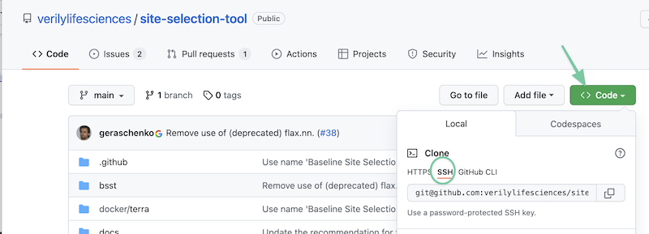
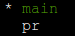
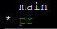
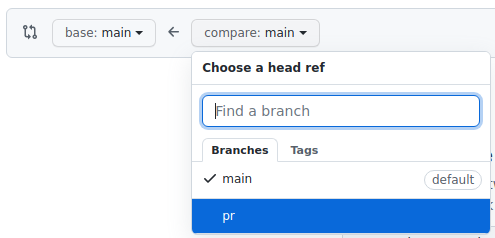
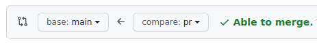
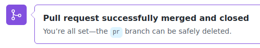

# Best practices for source control on Terra, Part III: Source control for notebooks


<!-- ## Author: cbussler@, jtbates@, amyu@ \
Last Updated: 30/03/2022 -->

- [Best practices for source control on Terra, Part III: Source control for notebooks](#best-practices-for-source-control-on-terra-part-iii-source-control-for-notebooks)
- [Introduction and Scope](#introduction-and-scope)
- [Objectives](#objectives)
- [Source control for notebooks](#source-control-for-notebooks)
  - [User journeys and work patterns](#user-journeys-and-work-patterns)
    - [Journey 1: Managing my own work without any collaboration](#journey-1-managing-my-own-work-without-any-collaboration)
    - [Journey 2: Starting with copies of existing artifacts](#journey-2-starting-with-copies-of-existing-artifacts)
    - [Journey 3: Initiating a collaboration with others](#journey-3-initiating-a-collaboration-with-others)
    - [Journey 4: Joining an ongoing collaboration with others](#journey-4-joining-an-ongoing-collaboration-with-others)
    - [Switching between journeys](#switching-between-journeys)
    - [Submitting to GitHub at the end of the day: essential work habit](#submitting-to-github-at-the-end-of-the-day-essential-work-habit)
  - [Journey 1: Managing my own work without any collaboration](#journey-1-managing-my-own-work-without-any-collaboration-1)
    - [Initial setup and ongoing work](#initial-setup-and-ongoing-work)
    - [Initiating work from the beginning](#initiating-work-from-the-beginning)
    - [Use case 1: Create a new repository and add your files to it](#use-case-1-create-a-new-repository-and-add-your-files-to-it)
      - [1. Create the repository](#1-create-the-repository)
      - [2. Clone the repo to your Cloud Environment](#2-clone-the-repo-to-your-cloud-environment)
      - [3. Add some subdirectories under the new repo directory](#3-add-some-subdirectories-under-the-new-repo-directory)
    - [Use case 2: Transfer workspace artifacts into your local repository](#use-case-2-transfer-workspace-artifacts-into-your-local-repository)
    - [Use case 3: Review changes and prepare commit (staging)](#use-case-3-review-changes-and-prepare-commit-staging)
    - [Use case 4: Commit your local changes](#use-case-4-commit-your-local-changes)
    - [Use case 5: Submit your local repository by push or pull request](#use-case-5-submit-your-local-repository-by-push-or-pull-request)
      - [Push](#push)
      - [Pull request](#pull-request)
    - [Continuously making and committing changes](#continuously-making-and-committing-changes)
    - [Use case 6: Retrieve the content of your repository from GitHub](#use-case-6-retrieve-the-content-of-your-repository-from-github)
    - [Use case 7: Work on research variants in Git branches](#use-case-7-work-on-research-variants-in-git-branches)
    - [Use case 8: Save incomplete or inconsistent work in GitHub](#use-case-8-save-incomplete-or-inconsistent-work-in-github)
    - [Use case 9: View changes and diffs in Git](#use-case-9-view-changes-and-diffs-in-git)
  - [Journey 2: Starting with copies of existing artifacts](#journey-2-starting-with-copies-of-existing-artifacts-1)
    - [Use case 10: Clone an existing workspace](#use-case-10-clone-an-existing-workspace)
    - [Use case 11: Populate newly created workspace with existing artifacts](#use-case-11-populate-newly-created-workspace-with-existing-artifacts)
    - [Next steps](#next-steps)
  - [Journey 3: Initiating a collaboration with others](#journey-3-initiating-a-collaboration-with-others-1)
    - [Collaboration is concurrent changes to source control](#collaboration-is-concurrent-changes-to-source-control)
    - [Use case 12: Establish a source controlled workspace and remote repository](#use-case-12-establish-a-source-controlled-workspace-and-remote-repository)
    - [Use case 13: Enable access to GitHub repository to collaborators](#use-case-13-enable-access-to-github-repository-to-collaborators)
    - [Use case 14: Reconcile local repository (all the time)](#use-case-14-reconcile-local-repository-all-the-time)
    - [Use case 15: Collaborate on a variant](#use-case-15-collaborate-on-a-variant)
  - [Journey 4: Joining an ongoing collaboration with others](#journey-4-joining-an-ongoing-collaboration-with-others-1)
    - [Use case 16: Clone GitHub repository](#use-case-16-clone-github-repository)
    - [Next steps](#next-steps-1)
  - [Journey 5: Constructing a new workspace from an existing GitHub repository](#journey-5-constructing-a-new-workspace-from-an-existing-github-repository)
    - [Use case 17: Populating a new workspace with notebooks from a GitHub repository](#use-case-17-populating-a-new-workspace-with-notebooks-from-a-github-repository)
- [References](#references)

# Introduction and Scope

This document describes best practices for source code control in [Terra Workspaces](https://app.terra.bio/) for artifacts like [notebooks](https://support.terra.bio/hc/en-us/articles/360059009571-Notebooks-Quickstart-Guide),
[Python and R packages](xxx) or [workflows](https://support.terra.bio/hc/en-us/articles/360034701991-Pipelining-with-workflows). The goal of this solution is to enable you to manage, share and collaborate on artifacts effectively using the source code control system [GitHub](https://github.com/). In the following we use the term “source control” for brevity.

The initial focus is on source controlling notebooks and not on other artifacts like workflows. Those are discussed separately at a later point in time. Source controlling notebooks is a major predominant use case and will have the biggest benefit for Terra users (including All of Us Workbench users).

> **All of Us Workbench**: The All of Us workbench differs from the general [Terra.bio](https://app.terra.bio/) system in a few areas. These differences are called out so that this solution applies to the All of Us workbench as well. The differences in the context of source control are addressed in the callouts with the left bar on the side – like this paragraph.

The best practices do not discuss the management of data like workspace tables, reference data, samples in buckets, tables in BigQuery, or any other data - the discussion is focused on code only.

While this document walks you through the basics of using git for various use cases, it will be helpful to have a basic understanding of git as well.  The GitHub [documentation](https://docs.github.com/en) and “cheat sheets” like [this one](https://education.github.com/git-cheat-sheet-education.pdf) may be useful.


# Objectives

Reading this document and executing the commands provide you with the required knowledge and toolset to:

*   Learn to use source control for notebooks
*   Learn to prepare your Terra cloud environment and reinitialize it after its restart or its recreation
*   Learn about the Terra workspace deployment architecture and understand the various storage systems involved
*   Learn about several source control user journeys and the use cases that enable them


# Source control for notebooks

This document is shaped by the following high-level recommendations for working with git repositories:

*   We recommend setting up a **1:1 correspondence between workspaces and repositories** if that makes sense for your use case.  So, you may want to mirror your workspace name in the name of your new repo.
*   Even if you’re the only one working in the repo, we recommend doing new work in a new _branch_ of your repo, rather than making modifications directly in the `main` branch, then merging those changes via a [pull request](https://docs.github.com/en/pull-requests/collaborating-with-pull-requests).  However, this pattern is not required if you’re working alone.


## User journeys and work patterns

This section discusses the main source control activities that you encounter. There are four source control journeys and most likely you use one or several of them during your research work. Each is discussed briefly first before outlined in detail in separate sections.


### Journey 1: Managing my own work without any collaboration

The first journey is about working by yourself without any collaboration with others. You initiate the work and the repository for the workspace, and from then on submit to it as your work progresses.

You have – at least initially – no intention to share the repository with others and so your repository contains only your work. This means that you create the initial repository, and submit your work to it over time. The section [Journey 1: Managing my own work without any collaboration](#journey-1-managing-my-own-work-without-any-collaboration) guides you through the various use cases like creating a repository or submitting to it.


### Journey 2: Starting with copies of existing artifacts

This journey is the same as Journey 1, except that it does not start creating notebooks from the beginning. It starts with copying or obtaining existing notebooks as a starting point.

[Journey 2: Starting with copies of existing artifacts](#journey-2-starting-with-copies-of-existing-artifacts) will provide the various use cases.


### Journey 3: Initiating a collaboration with others

In many instances you plan to start a collaboration with your colleagues or even users that you know only by reputation. [Journey 3: Initiating a collaboration with others](#journey-3-initiating-a-collaboration-with-others) discusses how to start a collaboration and how to ensure that all work or all collaborators is synchronized and consistent. It also provides a brief introduction on the parallel nature of collaboration and how GitHub supports it.


### Journey 4: Joining an ongoing collaboration with others

This journey guides you through the basic steps to join an ongoing collaboration. An ongoing collaboration has a remote GitHub repository that you participate in once you get invited to join.

This can be in conjunction with an existing workspace that is shared with you, or it can be in the context of your own workspace that you create for this purpose.

See [Journey 4: Joining an ongoing collaboration with others](#journey-4-joining-an-ongoing-collaboration-with-others) for detailed instructions.


### Switching between journeys

It is entirely possible that you start with one journey, and later on switch to another. For example, you might start working by yourself (Journey 1) and after a while decide to collaborate with others (Journey 3).

This is entirely possible and happens quite often as your research progress will dictate the best way: collaborating with others or working by yourself. Git was designed for collaboration and therefore switching journeys is easily possible without additional work or setup.


### Submitting to GitHub at the end of the day: essential work habit

It is best practice to submit your work to GitHub at the end of the day or during the day when you completed a part of your research. This is an important work habit to acquire as it will ensure that you are not losing work when the cloud environment is deleted for any reason – by you or by someone else.

Of course, it might be entirely possible that at the end of the day your work is unfinished and not in a consistent but intermediary state. You can submit to GitHub an intermediary state without problem, and it is best to submit any intermediary state in a Git branch so that no merge with the main branch is required. This approach ensures that your work is in GitHub while you are not possibly interfering with others that work on the same repository.

To repeat it here, any changes you make to notebooks will only be in the local GitHub repository if you copy them from the `edit/` directory to the local GitHub repository before submitting the changes to GitHub.

**All of Us Workbench**. The folder is `/home/jupyter/workspaces/<workspace-name>`

Note: the auto saving functionality that Terra provides only saves notebooks that are in the `edit/` directory. It does not save any other artifacts, and it does not save notebooks from any other directory location. Because of this restriction it is best that you do not rely on the autosaving functionality and instead submit to GitHub when you want to save your work.


## Journey 1: Managing my own work without any collaboration

This journey outlines the various use cases you use when working by yourself. Many of the use cases apply later to other journeys as well.


### Initial setup and ongoing work

Setting up a new local repository is done once. This is outlined by [Use case 1](#use-case-1-create-a-new-repository-and-add-your-files-to-it) next.

The remaining use cases (starting with Use case 2) are used iteratively throughout the duration of your research project. You continuously make changes in the workspace, copy them to the local repository and then synchronize the local repository with the remote repository on GitHub. The different use cases show the various steps for you to execute.


### Initiating work from the beginning

How do you start after you created a Terra workspace? When using notebooks as an example, you can create an empty notebook and start adding and modifying cells that represent your research over time.

It is possible for you to create several notebooks as well. In fact, you can create any number of notebooks that you need for your research.


### Use case 1: Create a new repository and add your files to it

This use case sets up a new repository. This is a one-time task, and you do not repeat this again for this repository.


#### 1. Create the repository

The most straightforward way to create a new repository is via GitHub in the browser.  Follow[ these instructions](https://docs.github.com/en/get-started/quickstart/create-a-repo). (This creates an ‘empty’ repo that you’ll populate with your workspace files as described below).


    **Note**: It is also possible to initialize a new repository locally from the command line rather than via the browser UI. See[ these instructions](https://docs.github.com/en/get-started/importing-your-projects-to-github/importing-source-code-to-github/adding-locally-hosted-code-to-github) if you’d prefer that.


#### 2. Clone the repo to your Cloud Environment

Start your workspace Cloud Environment if it’s not already running, and open a terminal window.

Then, [clone the repo](https://docs.github.com/en/repositories/creating-and-managing-repositories/cloning-a-repository) to your Cloud Environment. This is similar to what you did for the example in , but using your new repo’s URI. You can copy the URI for your new repo from the green **Code **button on the web page for your repo.**  **Make sure that you select the **SSH** option.



**Edit the following command for your repo** before running it:

```sh
$ git clone git@github.com:<your-repo>.git
```

([Use Case 16](xxx) also walks through this process).


#### 3. Add some subdirectories under the new repo directory

Next, we’ll add some suggested organizational structure to the new repo.

1. Still working in the Terminal, set `REPO_HOME` to the path to your newly cloned repository:
    ```sh
    REPO_HOME=$HOME/<your-repo-name>
    cd $REPO_HOME
    ```


2. In $`REPO_HOME`, create several subdirectories for different type of artifacts
    ```sh
    mkdir notebooks
    mkdir workflows
    mkdir workspace-description
    ```

> **Note**: while this doc focuses primarily on notebooks, these additional directories serve as illustrations where other artifacts might be stored. If you have Python or R packages as well, you might create subdirectories called `python-packages` or `r-packages`.


In the next Use Case sections, we’ll walk through how to copy your workspace files to your new repo and commit the changes– so that there is something actually _in_ the new repo.

### Use case 2: Transfer workspace artifacts into your local repository

Once you are done making changes to a notebook, or if you want to record a particular state of a notebook, then you need to add or update the notebook in your local repository and subsequently submit the local repository to the remote repository. This use case describes the transfer (copy) of the notebook from its workspace location to the local repository.


1. If you do not have a notebook, create one and make some modifications. When working on your research, this is a standard activity. Make all the desired changes before moving to the next step.
2. Copy the notebook from the `edit/` folder of the workspace to the notebooks folder in the local repository.  **Edit the cp command appropriately before running it**:
   ```sh
   REPO_HOME=$HOME/<your-repo-name>
   WS_NAME=<your-workspace-name>`
   cp $HOME/$WS_NAME/edit/<notebook> $REPO_HOME/notebooks
   ```
   > **All of Us Workbench**: The workspace folder is `/home/jupyter/workspaces/<workspace-name>`

3. Navigate to the local repository
    ```sh
    cd $REPO_HOME
    ```

At this point you have copied the latest state of the notebook from the Terra workspace location to the local repository. The next step is to prepare for a `commit` to the repository.


### Use case 3: Review changes and prepare commit (staging)

When making several changes, you can check the changes in the local repository to confirm that these are the changes you want to commit and later submit to the remote repository.

1. Navigate to the local repository
    ```sh
    cd $REPO_HOME
    ```

2. The following command shows you the changes that will be committed once you are ready to commit:
    ```sh
    git status
    ```
    This lists all the changes since the last time the local repository was committed. Confirm that these are the changes that you want to submit to the remote repository.

3. Use the following command to include all changes into the commit. This is called “staging”.
    ```sh
    git add *
    ```
    If you only want to add a subset of the files, then use the file name instead of the asterisk and run the command for every file you want to add.
    ```sh
    git add <filename>
    ```

4. If you run `git status` again, you see all files that were added to the commit and for each file it is indicated if it is new, modified or deleted:
    ```sh
    git status
    ```
    Note that the output changed from
    ```
    Changes not staged for commit:
    ```
    to
    ```
    Changes to be committed:
    ```

You are ready now to commit and to submit the changes to the remote repository.


### Use case 4: Commit your local changes

Before submitting to the remote repository, you must commit the changes to your local repository.

1. The following command initiates the commit that includes all changes made and that you can see with `git status`:
    ```sh
    git commit
    ```
    This command opens an editor for you to add a commit message. The commit message is ideally a brief and succinct statement of the changes you are about to commit. When you save the content in the editor, the commit takes place

    The output of this command shows the commit message and some statistics about the commit, for example,
    ```
    [main 9df06c9] Additional changes
     1 file changed, 1 insertion(+), 1 deletion(-)
    ```

2. This command shows you the past few commits, including the commit  you just executed
    ```sh
    git log
    ```

It might happen that you commit changes accidentally and want to reverse that commit. The following command [git reset](https://git-scm.com/docs/git-reset) un-commits (note the option `--soft`):

```sh
git reset --soft HEAD~1
```

> **Note on efficiency**: Use case 3 and 4 separate staging from the commit, meaning, you first explicitly stage the changed files that you want to commit, and then commit those changes. If you are using the system frequently, this might get quite tedious. There is a shortcut available that combines both: `git commit -a`. This command stages and commits at the same time (however, be aware that newly added files are not included). Best practice is to start with explicit staging, and once you are familiar with the process, use the shortcut for efficiency.


### Use case 5: Submit your local repository by push or pull request

Now you are all ready to submit the changes committed to the local repository to the remote repository. At this point you decide if you simply [push](https://github.com/git-guides/git-push) the changes, or create a [pull request](https://docs.github.com/en/github/collaborating-with-pull-requests/proposing-changes-to-your-work-with-pull-requests/about-pull-requests).

A push takes the changes that you committed to the local repository and applies those to the remote repository. After the push both, the local repository and the remote repository have the same content.

A pull request does not update the remote repository. Instead, it opens a todo item in GitHub that contains the changes from the local repository. Those are made available to your colleagues with a request for review and merge. This means that anybody who you choose to be notified can provide comments to you (for example, point out areas that need clarification) or somebody can apply the changes to the remote repository.

Why would you want to use pull requests when working by yourself? In addition to pull requests being a collaboration feature (peer review), those are also a nice way to record changes in commits over time. The pull requests will remain available for review and this means that you can look back and see very easily what you changed at every commit. Without pull requests you have to review the history of individual artifacts.


#### Push

The following commands show the push request, afterwards the pull request approach is shown.

1. Navigate to the local repository:
    ```sh
    cd $REPO_HOME
    ```

2. Run the command:
    ```sh
    git push
    ```

3. Once the command is completed you can check that the remote repository was updated.
4. Also note that any cell outputs have been stripped out and are not in the remote GitHub repository.

#### Pull request

In order to show how to commit data using a pull request you need to make changes to the notebook first, copy it to the local repository and stage it. Before you copy the data to the local repository, you must switch to the branch from which the pull request originates.

Pro tip: if you accidentally staged the changes in the local main branch instead of the branch for the pull request, use `git stash` to move the staged files between branches.

1. To create a pull request, create a branch with the name `pr` (for pull request – you can choose your own name)
    ```sh
    git branch pr
    ```

2. To check, list all the branches in your local repository
    ```sh
    git branch
    ```

3. As you can see, `pr` was created alongside main
4. Note that there is an asterisk next to main, which indicates that you are working in this branch:

   

5. For the pull request, change to the branch `pr`
    ```sh
    git checkout pr
    ```

6. Run git branch again and observe that now you are working in the `pr` branch:

   

7. Now copy the notebook to the local repository. This copies the changes to the `pr` branch of the local repository.
8. Stage the changes
9. You staged the changes, now they are ready to be committed to the `pr` branch. This is necessary because only committed changes can be synchronized with a corresponding branch in the remote repository.
    ```sh
    git status
    git commit
    ```


10. The following command creates the branch `pr` in the remote repository and uploads the changes to it
    ```sh
    git push --set-upstream origin pr
    ```

11. Log into `github.com` and navigate to your corresponding remote repository
12. Observe that the branch pr does exist in addition to main by clicking on this button

    

13. Open the notebook you just committed in the `pr` branch and observe that the outputs were removed from it (as it should since you installed the nbstripout tool earlier).

At this point the branch `pr` is created and the changes that you plan to commit are in that branch. The next steps create the pull request. A pull request in principle establishes a todo item that requests receiving users to review the proposed changes and to comment on them or to initiate a merge into the `main` branch (that is always considered the consistent and latest “ready to use” version of a file).

Since you are working by yourself in this journey, you will merge the changes yourself. The benefit of a pull request in this situation is that it records the changes and in the future you are able to look back and review the changes.

1. Navigate to the remote repository on github.com
2. Click on **Pull requests**:

   


3. Click on **New pull request**:

   


4. Select `pr` as the compare branch:

   


5. This results in:

   


6. Observe that further down on that page the code changes are highlighted in the textual representation of the notebook
7. Click **Create pull request**:

   


And click on that button again. You can add a comment for the pull request if you wish.

8. This navigates to the newly created pull request. Further down, click on "Merge pull request":

   


9. and click on "Confirm merge":

   


10. This results in:

   


11. You can delete this branch at this point, but also keep it for future pull requests. If you delete it, you have to recreate the branch for the next pull request. Either approach is fine, but keeping it is less work overall.

At this point your change is merged into the main branch of the remote repository, but not yet in the corresponding main branch of your local repository. The next steps show you how to ensure that the local repository is synchronized with the remote repository.


1. Open a terminal window in the workspace (unless you have one open already)
2. Navigate to the local repository:
    ```sh
    cd $REPO_HOME
    ```

3. Change to the main branch:
    ```sh
    git checkout main
    ```

4. Synchronize the local repository with the remote repository:
    ```sh
    git pull
    ```

Now you are all set and the local as well as remote repositories are synchronized.

Push is a lot briefer from a process viewpoint compared to pull requests. However, pull requests are the best mechanism to formalize the (peer-) reviewing of changes and to capture the progress over time. In the context of collaboration pull requests are the best practices approach.


### Continuously making and committing changes

You have now gone through a full set of use cases that started with creating a notebook, copying it to the local repository, staging it, committing it, and synchronizing the remote repository though either push or pull requests.

This process you can repeat as often as you need to. As you make progress with your research in the notebook, or as you add additional notebooks, or remove notebooks, the process remains the same and after a while the commands become second nature.

Ideally you make many small consistent changes and commit often to the repository. Since GitHub maintains the history of changes, you will always be able to see what you did in the past. Fewer and larger changes are possible as well, of course, but over time it is hard to understand each change if a lot of content changed. A lot of valuable input and discussions are available on the Web when you search for “small commits in GitHub”.


### Use case 6: Retrieve the content of your repository from GitHub

As you have seen in case of pull requests, the content of the remote repository can change independently of the content of your local repository. This situation can arise for any of the branches individually, meaning, the content of one branch changes in the remote repository, but others remain unchanged.

The best approach to ensuring that your local repository is in sync with the remote repository is as follows:

1. Navigate to the local repository:
    ```sh
    cd $REPO_HOME
    ```

2. List all branches:
    ```sh
    git branch
    ```

3. Change to the branch that you like to synchronize with:
    ```sh
    git checkout <branch-name>
    ```

4. Run the following command (it updates the local repository with the state of the remote repository):
    ```sh
    git pull
    ```

After this sequence of commands, the state of the local branch is equivalent to that of the remote branch. If you have several branches you run the commands for every branch.


### Use case 7: Work on research variants in Git branches

You are already aware of branches since you used the branch `main` and `pr` (if you tried the pull request route earlier).

The `main` branch is usually the branch that contains the latest consistent and tested version of code (production code), in our case notebooks. If changes to a notebook are committed to `main` it means that the changes have been reviewed and tested and the notebook’s cells work as intended.

Exploratory work, or regular development work ideally happens in a separate branch, and the name of the branch should reflect the work to the extent possible. This arrangement allows you to try out alternative paths, delete code and change code as necessary to implement the next phase.

Once you are in a good state, you follow the pull request approach to synchronize the data with the same branch in the remote repository, and using a pull request the code gets merged into the `main` branch. With `git pull` you update your local `main` branch to match the remote `main` branch.

You can create as many branches as you need in case you are trying different alternatives of implementing a feature and want to keep those trials separate. If you try out alternative implementations for the same feature, the different branches are actually variants of each other.

If you have several branches then it is possible that they advance differently. The following shows you one scenario with a `main` branch and two variant branches, `attempt-1` and `attempt-2`. You will create the two variant branches, make different changes, and then create a pull request for one of the branches. Afterwards, through merging, all branches are being brought into a synchronized state.

1. Navigate to the local repository:
    ```sh
    cd $REPO_HOME
    ```

2. List all branches:
   ```sh
   git branch
   ```
   
   At this point you have either only the `main` branch, or `main` and `pr`, depending on your previous decisions.

3. Create two branches:

    ```sh
    git checkout -b attempt-1
    git checkout -b attempt-2
    git branch
    ```

   

    The two branches, `attempt-1` and `attempt-2` both have the same state as the `main` branch when created (since you created those while being on the `main` branch). Now you will make changes in different branches and commit one of the branches.

4. In the local repository, switch to the `main` branch and verify that the switch took place:
    ```sh
    cd $REPO_HOME
    git checkout main
    git branch
    ```
    If you pulled from `main` and have not yet copied the notebook from `main` to the `edit/` folder then copy the notebook:
    ```sh
    cp notebooks/<your-notebook> $HOME/<workspace-name>/edit/
    ```
    > **All of Us Workbench**: The folder is `/home/jupyter/workspaces/<workspace-name>`

5. Change the notebook by e.g. adding a cell
6. Copy the notebook to the branch `attempt-1` and stage the change:
    ```sh
    git checkout attempt-1
    cp $HOME/<workspace-name>/edit/<your notebook> $REPO_HOME/notebooks/
    git commit
    ```

7. Make another change to the notebook
8. Copy the notebook to the branch `attempt-2` and stage the change:
    ```sh
    git checkout attempt-2
    cp $HOME/<workspace-name>/edit/<your notebook> $REPO_HOME/notebooks/
    git commit
    ```

At this point, the notebook in the branches `main`, `attempt-1` and `attempt-2` are different. While `main` is the last “good” version, `attempt-1` and `attempt-2` contain two alternative changes. Let’s assume that `attempt-1` is ready for integration into `main`.

1. Submit the committed changes in `attempt-1` by a pull request (use case 5 from above)
2. Now the remote `main` branch has the latest update
3. Synchronize the local `main` by following the use case 6
4. Now the local `main` branch is up-to-date

The `main` branch is up-to-date and it is best that the other two branches are updated to the state in `main` as well.

1. Switch to `attempt-1`
    ```sh
    git checkout attempt-1
    ```

2. Run a merge statement incorporating `main` into `attempt-1`
    ```sh
    git merge main
    ```

Now execute the same commands for `attempt-2`:

*   Switch to `attempt-2`
    ```sh
    git checkout attempt-2
    ```

*   Run a merge statement incorporating `main` into `attempt-2`:
    ```sh
    git merge main
    ```

The system might ask for a commit message since you are merging code. If there is a conflict, you have to resolve that using the standard approach to code conflict resolution, as pointed out in [part 1](./terra_source_control_I.md) of this document.

Now all branches, `main`, `attempt-1` and `attempt-2` are consistent again. Based on the use case, `main` and `attempt-1` have the same content, but `attempt-2` should have a different state. How can you check this?

1. Run the following commands to see the differences:
    ```sh
    git checkout attempt-1
    nbdiff main
    ```
    > Note: there are no differences between `attempt-1` and `main`

2. Run the same commands for `attempt-2`:
    ```sh
    git checkout attempt-2
    nbidff main
    ```

> Note: observe the differences between `attempt-2` and `main` that exist now that the state of `main` was merged into `attempt-2`.

### Use case 8: Save incomplete or inconsistent work in GitHub

Sometimes you reach the end of the workday, however, the work and changes in a notebook are not ready to be integrated into the main branch.

One possibility to address this situation is to do nothing (yay!). However, in this case the changes you made are only stored on the persistent disk, and those might have been replicated to the workspace bucket if the notebook is known to the Terra workspace. If for any reason the persistent disk is deleted, and the automatic replication to the workspace bucket failed, your work would be lost.

Alternatively, in order to address this risk, you could use GitHub to serve as temporary redundant storage backup. A good practice is to commit and submit that to GitHub at the end of the workday, as indicated already here: [Submitting to GitHub at the end of the day: essential work habit](xxx).

You have worked with branches at this point and the best practice is to create a branch in your local repository, copy the notebooks that changed to it, and submit those to the remote repository, following the use cases 2 to 5. In this case no pull request is required as there will be no merge at this point to the main branch.


### Use case 9: View changes and diffs in Git

Viewing changes in the local repository are best done with [nbdiff](https://nbdime.readthedocs.io/en/latest/) and [git diff](https://git-scm.com/docs/git-diff). You have used these commands in basic form already in previous use cases. The commands can handle much more complex cases of showing diffs and it is best for you to read the documentation and try out the more complex features they provide.

In GitHub diffs are shown in a more graphical form. Try it out by following these steps:

1. Log into your GitHub account
2. Select a repository that contains notebooks that have several versions
3. Select the **<> Code** tab

<p id="gdcalert17" ><span style="color: red; font-weight: bold">>>>>  GDC alert: inline image link here (to images/image15.png). Store image on your image server and adjust path/filename/extension if necessary. </span><br>(<a href="#">Back to top</a>)(<a href="#gdcalert18">Next alert</a>)<br><span style="color: red; font-weight: bold">>>>> </span></p>


4. Navigate into the source code tree to an individual notebook. For example,


<p id="gdcalert18" ><span style="color: red; font-weight: bold">>>>>  GDC alert: inline image link here (to images/image16.png). Store image on your image server and adjust path/filename/extension if necessary. </span><br>(<a href="#">Back to top</a>)(<a href="#gdcalert19">Next alert</a>)<br><span style="color: red; font-weight: bold">>>>> </span></p>


5. Click on History

<p id="gdcalert19" ><span style="color: red; font-weight: bold">>>>>  GDC alert: inline image link here (to images/image17.png). Store image on your image server and adjust path/filename/extension if necessary. </span><br>(<a href="#">Back to top</a>)(<a href="#gdcalert20">Next alert</a>)<br><span style="color: red; font-weight: bold">>>>> </span></p>


This shows all the changes to the notebook over time

7. Click on a hash, for example:

<p id="gdcalert20" ><span style="color: red; font-weight: bold">>>>>  GDC alert: inline image link here (to images/image18.png). Store image on your image server and adjust path/filename/extension if necessary. </span><br>(<a href="#">Back to top</a>)(<a href="#gdcalert21">Next alert</a>)<br><span style="color: red; font-weight: bold">>>>> </span></p>


8. This shows the changes made compared to the previous version:

<p id="gdcalert21" ><span style="color: red; font-weight: bold">>>>>  GDC alert: inline image link here (to images/image19.png). Store image on your image server and adjust path/filename/extension if necessary. </span><br>(<a href="#">Back to top</a>)(<a href="#gdcalert22">Next alert</a>)<br><span style="color: red; font-weight: bold">>>>> </span></p>


An alternative way is to review the list of pull requests. Each request shows the changes that were applied by executing it. While the above is showing the history for each file individually, pull requests show the changes of all files that were part of the pull request. If you change several files in order to implement a feature, a pull request ties all changes together.


## Journey 2: Starting with copies of existing artifacts

In many cases you might not start one or several notebooks yourself from the very beginning, but start with existing notebooks and refine or change those for your research.

There are basically two approaches to start with existing artifacts:

*   Clone a workspace
*   Create an empty workspace and place copies of existing notebooks into it

Existing workspaces or existing notebooks can be provided by data providers that show you how they used their data sets for some initial notebook specifications. Fellow researchers in your organization might have created workspaces that you think are a good starting point or research projects like https://allofus.nih.gov/ might have workspaces reflecting current research that you’d like to take as a starting point.

The same can be the case for notebooks that are independent of Terra workspaces. Data providers, fellow researchers, published academic papers or research projects point to notebooks that you can use as starting points.

Let’s look into each of the two approaches when starting with existing artifacts.

### Use case 10: Clone an existing workspace

In principle, you can clone any Terra workspace you have access to. This can be workspaces that are shared with you, featured workspaces from the library (https://app.terra.bio/#library/showcase), or public workspaces in the list of workspaces: https://app.terra.bio/#workspaces (click on the **Public (...)** tab).

In any case, in order to clone a workspace, open the workspace and find the menu with the three vertical dots. Click on it, and a menu appears.


Select the **Clone** entry and a form appears, for example:


Fill in the various fields and click **CLONE WORKSPACE**. The new workspace has copies of the notebooks and you are the owner.

This new workspace is now your starting point and you can start reusing and modifying its artifacts, deleting some, and adding new artifacts as your research demands.


### Use case 11: Populate newly created workspace with existing artifacts

An alternative approach to start with existing artifacts is to create a new workspace and place copies of artifacts that you get from elsewhere into the new workspace.

This basically means that you follow the steps to create a new workspace as follows:

1. Navigate to https://app.terra.bio/#workspaces
2. Click on the ‘**+**’ (plus) icon


3. Fill in the details in the appearing form


4. Click **CREATE WORKSPACE**

Now you have a new workspace that you can copy existing artifacts into. One approach to adding a document to the workspace is by using the file dialog of Jupyter. This process you have seen before: open a notebook, and click on the Jupyter logo; this opens a file browser dialog that lets you upload files into the Terra cloud environment.

If you upload a notebook, place it into the `<workspace-name>/edit` folder. Once you open the notebook in edit mode, Terra will incorporate it as a notebook known by Terra. This is the process as described in
[Creating notebooks by copying into edit/ folder](xxx).

> **All of Us Workbench**: The folder is `/home/jupyter/workspaces/<workspace-name>`

### Next steps

Once you have either a cloned workspace or created a new workspace with copied artifacts, you have the starting point for the other journeys described in this solution. There are no specific use cases for this journey other than the two described so far.


## Journey 3: Initiating a collaboration with others

This journey shows you the steps for initiating a collaboration with others using GitHub as well as for some ongoing use cases you might perform over time.


### Collaboration is concurrent changes to source control

Before going into the procedural details, a quick note collaboration using remote GitHub repositories that explains the underlying parallelism that you have to be aware of.

In a collaboration with remote GitHub repositories, many collaborators can make changes at the same time. What does this mean? There are two types of repositories (as you are already aware of), local and corresponding remote repositories. Each repository changes and advances at its own pace, and every now and then they are synchronized to ensure that all changes are compatible over time.

In concrete terms this means that you create a remote repository, and then invite collaborators. Once you send the invite, the collaborators can create their own local repositories from the remote repository. Their local repository has the state of the time when they downloaded the content of the remote repository.

As you have seen before, everybody can make changes to their local repositories. [Use case 5](#use-case-5-submit-your-local-repository-by-push-or-pull-request) explained how to submit changes from the local to the remote repository when you think you have reached a good modified state of the artifacts.

As soon as a collaborator user submitted a change to the remote repository, and as soon as that change was accepted, the remote repository changed. It is in your interest to now synchronize your local repository with the remote repository so that you have the latest state locally available as well. [Use case 6](#use-case-6-retrieve-the-content-of-your-repository-from-github) discussed this and [Use case 14](#use-case-14-reconcile-local-repository-all-the-time) discusses it as well.

It might be that the remote repository gets changed often while you work at a difficult change yourself that takes a while. Ideally, you synchronize often so that you can see the changes as they occur so that your work and the changes in the remote repository do not diverge too much. This is especially helpful if you need to discuss a change with the author as at this time the author is still aware of all details of the change the author made. It also helps you since incorporating many small changes individually is a lot easier then incorporating many changes in one big synchronization.

In summary, all collaborators work at their own pace, and when they reach a good state in their changes, they submit their changes to the remote repository, preferably using pull requests. Then you have to synchronize your local repository with the remote repository to see the latest changes. Every collaborator engages in this continuous synchronization and submitting changes.

GitHub plays the role of the single source of truth and ensures that there are no conflicts. If it detects a conflict, it will let you know at the time of synchronization and you can resolve the conflict at this point in time. Sometimes it might help to cooperate with the author of a change on that.


### Use case 12: Establish a source controlled workspace and remote repository

Initiating a collaboration starts with either establishing a new workspace and sharing it with collaborators, or simply sharing an existing workspace with collaborators.

In addition, you have to either [create a remote GitHub repository](https://docs.github.com/en/get-started/quickstart/create-a-repo) (possibly in case of a new workspace), or identify the GitHub repository that corresponds to the existing workspace.

It does not necessarily have to be a single repository, it could be several at the same time.


### Use case 13: Enable access to GitHub repository to collaborators

In order to add collaborators to a remote repository, follow these steps:

1. in GitHub, navigate to the **Settings** section:

   

2. On the left pane, select **Manage access**

   

3. On the right pane select **Add people**

   

4. The dialog that opens provides you with an interface of selecting collaborators

   

Once invited, collaborators have access to the remote repository.

### Use case 14: Reconcile local repository (all the time)

Best practice is to reconcile a local repository before submitting a git pull request. Submitting a git pull request is shown in [Use case 5: Submit your local repository by push or pull request](#use-case-5-submit-your-local-repository-by-push-or-pull-request).

Reconciling your local repository with the corresponding remote repository is accomplished by a git pull request. [Use case 6: Retrieve the content of your repository from GitHub](#use-case-6-retrieve-the-content-of-your-repository-from-github) provided the discussion on reconciling.

Note, as discussed previously, in Git and GitHub you operate on branches of repositories. The branch that by convention contains the latest good state of artifacts is called main. But there might be other branches that you might have created to work on changes, or branches that you and another collaborator agreed on for a more direct collaboration on a specific aspect (more on that approach in [Use case 15: Collaborate on a variant](#use-case-15-collaborate-on-a-variant)).

One strategy is to reconcile every workday e.g. in the morning with a git pull request on each of the branches that have collaborators. Another strategy is to run a git pull request after every change in the remote repository.

You find your own best strategy, however, best practice is to reconcile often as the amount of change you have to comprehend is smaller than if many changes are reconciled at once.

It is possible that a conflict arises. A conflict arises if a change a collaborator made and a change you are working on are incompatible from a code perspective. Git will call this out and let you know that there is a conflict. In this case you have to [resolve the conflict](https://docs.github.com/en/github/collaborating-with-pull-requests/addressing-merge-conflicts/resolving-a-merge-conflict-using-the-command-line) by either changing the artifact in your local repository to match that in the remote repository, or change the contents of the remote repository, ideally in cooperation with the author of the conflict.


### Use case 15: Collaborate on a variant

As you recall, [Use case 7: Work on research variants in Git branches](#use-case-7-work-on-research-variants-in-git-branches) introduced branches, and how to create them. [Use case 8: Save incomplete or inconsistent work in GitHub](#use-case-8-save-incomplete-or-inconsistent-work-in-github) explained that a branch that is different from main can be submitted to GitHub as well.

In the context of collaboration, you can create a branch, submit it, and collaborate with another user on that branch. So you can create a collaboration between you and any number of collaborators on a dedicated branch that is shared between you.

Once you arrived at a good state of the artifact and all changes were made, you can submit a pull request on that branch to have it merged into main. Afterwards you can delete the branch, unless you want to continue the collaboration.

The branching feature supports collaborating on a variant (or several at the same time) with others, and you can create branches just for your own work, as you have seen earlier.


## Journey 4: Joining an ongoing collaboration with others

While Journey 3 gave you the use cases to initiate a collaboration with other researchers, this journey is from the viewpoint of a user being invited to a collaboration. In this case you get an invitation to collaborate on a remote GitHub repository.

There is only one specific use case for this journey: cloning the remote GitHub repository into a workspace and then reviewing artifacts, changing them, and submitting them, as you would do in Journey 1 or Journey 3.

From a workspace perspective, there are two cases:

*   **Invitation to an existing workspace**. In this case you create your own cloud environment with a persistent disk.
*   **Creation of a new workspace**. In this case there was no workspace shared with you. You might ask for access to an existing workspace that might exist. If you cannot or will not be invited to one, you create your own workspace and create a cloud environment with a persistent disk.

Once you have a cloud environment, you follow the next use case.

### Use case 16: Clone GitHub repository

In order to clone a GitHub repository, follow these steps:


1. Get the clone URI. It might have different forms as shown in this screenshot

   

2. Navigate to `$HOME`, or whichever directory in which you want to clone the repo.
3. Run the [git clone](https://git-scm.com/docs/git-clone) command
    ```sh
    git clone <repository-uri>
    ```
    This will create a subdirectory with the name of the GitHub remote repository and transfers all the code into it. If the repository was created following the earlier best practices, the remote repository name corresponds to a workspace name.

### Next steps

Now you have a local repository corresponding to the remote GitHub repository, and can start reviewing the artifacts as well as contributing to them following previous use cases in Journey 3 as well other journeys.

## Journey 5: Constructing a new workspace from an existing GitHub repository

Sometimes it's not possible to clone an existing workspace.  For example, it's not currently possible to move a workspace to a different [authorization domain](https://support.terra.bio/hc/en-us/articles/360026775691-Managing-data-privacy-and-access-with-Authorization-Domains). Instead, you must create a new workspace with the desired authorization domain and populate this new workspace with files from the GitHub repository.


### Use case 17: Populating a new workspace with notebooks from a GitHub repository

1. Create a new workspace
2. Set up your git environment as described in [Setting up all parts of your work environment](xxx)

3. Clone the GitHub repository into your workspace as described in [Use case 16: Clone GitHub repository](#use-case-16-clone-github-repository)
4. Use [gsutil](https://cloud.google.com/storage/docs/gsutil) to copy the notebooks from your local repository into the `notebooks` folder of the workspace bucket:
   ```sh
	 gsutil cp $REPO_HOME/notebooks/*.ipynb
 		$WORKSPACE_BUCKET/notebooks
   ```

The notebooks from the local repository should now be visible in the new workspace's "Notebooks" tab.

# References

*   [Terra](https://terra.bio/) and the [Terra system](https://app.terra.bio/)
*   [Detachable Persistent Disks – Terra Support](https://support.terra.bio/hc/en-us/articles/360047318551)