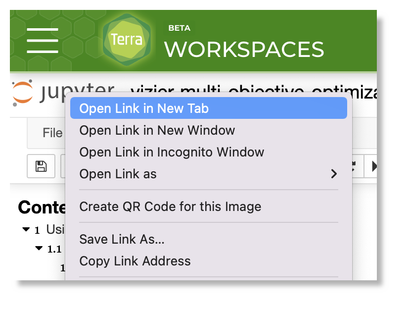

# Source control on Terra: cheat sheet

- [Source control on Terra: cheat sheet](#source-control-on-terra-cheat-sheet)
  - [Check only code (no data) into source control](#check-only-code-no-data-into-source-control)
    - [Exclude notebook outputs](#exclude-notebook-outputs)
    - [Exclude data files](#exclude-data-files)
  - [How to propagate notebook changes to source control](#how-to-propagate-notebook-changes-to-source-control)
    - [(1) Use the Jupyter console to upload your GitHub SSH key and create an interactive terminal session](#1-use-the-jupyter-console-to-upload-your-github-ssh-key-and-create-an-interactive-terminal-session)
    - [(2) Use the terminal to set up and clone your Git repository](#2-use-the-terminal-to-set-up-and-clone-your-git-repository)
    - [(3) Check in your code changes](#3-check-in-your-code-changes)
  - [FAQ](#faq)
    - [How do I make changes to my branch?](#how-do-i-make-changes-to-my-branch)
    - [I accidentally checked a new change to my main branch instead of a feature branch. How to fix this?](#i-accidentally-checked-a-new-change-to-my-main-branch-instead-of-a-feature-branch-how-to-fix-this)
      - [How do I revert a modified file to its committed version?](#how-do-i-revert-a-modified-file-to-its-committed-version)

This document summarizes some of the key practices described by the three-part document in this directory ([Part I](./terra_source_control_I.md), [Part II](./terra_source_control_II.md), [Part III](./terra_source_control_III.md)). It covers both [Terra.bio](https://app.terra.bio/) (Terra) workspaces and **All of Us Workbench** (AoU) workspaces.  In some cases there are differences between the two platforms.

<!--It's primarily intended for analysts using source control for the materials within the featured workspaces, but these source control practices could be used by any AoU researcher who would like to use source control to manage their analysis code.-->

## Check only code (no data) into source control

### Exclude notebook outputs

For the **All of Us Workbench**, the most important thing to remember is **notebooks checked into source control may not contain outputs**. Use [nbstripout](https://github.com/kynan/nbstripout) to remove all notebook outputs.
This screencast demonstrates the use and working principles behind the `nbstripout` utility and how to use it as a Git filter:

[](https://www.youtube.com/watch?v=BEMP4xacrVc)

On the **All of Us Workbench**, if you are using Git from the terminal of your workspace,
`nbstripout` is preinstalled and enabled. You can run `nbstripout --status` to confirm this.

For Terra example workspaces, you may decide to retain some notebook outputs for explanatory value,
depending upon context.  Be sure that you don't retain any sensitive data or personal config.


### Exclude data files

For your repository, use a [gitignore](https://git-scm.com/docs/gitignore) file similar to the
[.gitignore](https://github.com/DataBiosphere/terra-example-notebooks/blob/main/.gitignore) in this
repository to ensure that CSVs and image files are not accidentally commited to the repository.

If you are using Git from the terminal of your AoU workbench machine, a global `gitignore` file is
preinstalled and enabled. You can view file `/home/jupyter/gitignore_global` to confirm this.

On Terra, depending upon context, you may want to make some exceptions to this rule of thumb, e.g.
for example input data. It's best to retain a strict `.gitignore` file, and make any exceptions
manually via `git add`.

Always run `git status` to check the list of files you are about to commit prior to running `git
commit`.

## How to propagate notebook changes to source control

To use source control from your workspace, you'll need to set up authentication so that you can access your GitHub repo, and then use the Terminal to clone the repo and to manage and check in changes.  This section walks you through some of the most useful basics.  For more detail, see the other docs in this repo directory.

<!-- [If you want to use source control on your local machine, see the [local setup](./local_setup.md) instructions.] -->

### (1) Use the Jupyter console to upload your GitHub SSH key and create an interactive terminal session

  1. Open a notebook (any notebook) for editing, in the workspace where you would like to use source control.
  2. From the notebook, open the Jupyter console:

        * On AoU, if you are in **edit mode**, choose `File -> open` and the Jupyter console will display in a new browser tab.

        * Otherwise— if you are on Terra, or in **playground mode**, right click on the Jupyter logo at the top left of the Workbench UI and then choose `Open Link in New Tab`

        


  3. Use the Jupyter console to upload your [GitHub ssh key](https://docs.github.com/en/authentication/connecting-to-github-with-ssh/adding-a-new-ssh-key-to-your-github-account) (the file without the .pub extension).

     

     *Need help with this step? See [Creating your SSH keys](./terra_source_control_II.md#create-your-ssh-keys-on-your-laptop-or-desktop-computer).*

      > **Best practice**: your SSH key should require a passphrase.

      > **Tip**: if you create a new SSH key, don't forget to [add it to GitHub](https://docs.github.com/en/authentication/connecting-to-github-with-ssh/adding-a-new-ssh-key-to-your-github-account)!

  4. Create a terminal:

        * If you are in the Jupyter console, click on the `Files` tab, pull down the `New` menu towards the upper right of the screen, and choose `terminal`.
        * If you are on a workspace page, you can click on the terminal icon `>_` on the right hand side of the page.

### (2) Use the terminal to set up and clone your Git repository

Run the following commands from the Terminal.

  1. Tell Git who you are.
      ```sh
      # Edit these commands to have your name and your institutional email address.
      git config --global user.email "me@institution.org"
      git config --global user.name "Firstname Lastname"
      ```
      > *Need help with this step? See section in in `terra_source_control_II.md` on [Git setup](./terra_source_control_II.md#git-setup).*

  2. Configure `ssh-agent` to start every time you log in.

        ```sh
        echo 'eval "$(ssh-agent -s)"' >> $HOME/.bashrc
        source $HOME/.bashrc
        ```
        > *Need help with this step? See the section in `terra_source_control_II.md` on [setting up an ssh-agent](./terra_source_control_II.md#set-up-your-ssh-key-on-your-cloud-environments-persistent-disk).*

  3. Create a directory to hold your GitHub ssh key.

      ```sh
      mkdir -p ~/.ssh
      ```

  4. Add your ssh key.

      ```sh
      # Edit these commands to use the path to your ssh key.
      cd ~/.ssh
      mv ~/my-GitHub-ssh-key .  # Move your key file from whereever it was uploaded to this dedicated directory.
      chmod go-rwx my-GitHub-ssh-key
      ssh-add my-GitHub-ssh-key
      cd  # change back to your home directory
      ```
      > *Need help with this step? See the section in `terra_source_control_II.md` on [setting up an ssh-agent](./terra_source_control_II.md#set-up-your-ssh-key-on-your-cloud-environments-persistent-disk).*

  5. Clone the repository. If you like, you can create a sub-directory into which you clone all your
     repos.  In this example, we're just cloning into the home directory.

      Note: **this command is just an example**. If you need to commit code to a different
      repository, be sure to pass the correct value to `git clone`.

      ```sh
      git clone git@github.com:all-of-us/workbench-analysis-dev-tools.git
      ```
      > *Need help with this step? See the section in `terra_source_control_II.md` on
       [Cloning a repository](./terra_source_control_II.md#clone-a-first-github-repository)*.

### (3) Check in your code changes

  1. Create a new feature branch for your change.

      Note: **this command is just an example**. If you checked out a different repository, or
      checked it out into a different place, be sure to pass the correct value to `cd`.

      ```sh
      cd workbench-analysis-dev-tools
      git checkout -b my-feature-branch-name  # Create a new working branch in your repo checkout
      ```

  2. Copy the notebooks from the workspace directory to your Git clone.

      Note: **this command is just an example**. If you checked out a different repository or
      changed a different notebook, be sure to pass the correct values to `cd` and `cp`.

      ```sh
      # Suppose I edited ~/workspaces/myworkspace/run_hail_notebook_in_the_background.ipynb
      cd workbench-analysis-dev-tools/featured_workspaces/preprod/aou-rw-preprod-edf20f2f/
      cp ~/workspaces/myworkspace/run_hail_notebook_in_the_background.ipynb .
      ```

  3. Check that the changes look as you expect.

      Note: **this command is just an example**. If you changed a different notebook, be sure to
      pass the correct value to `nbdiff`.

      ```sh
      nbdiff run_hail_notebook_in_the_background.ipynb | more
      # You should see no outputs, only your code changes.
      ```

      Note: **if you don't see the changes that you expect, ask for some help!** Don't `git commit`
      or `git push` until you have confirmed that the diff is for the correct file, in the correct
      repository, and only shows your changes.

  4. Commit the change.

      Note: **this command is just an example**. If you changed a different notebook, be sure to pass the correct value to `git add`.

      ```sh
      git add run_hail_notebook_in_the_background.ipynb
      git status
      # You should see only the files you intend to commit listed (e.g., no data files).
      git commit
      ```
      > **Note:** The `git commit` step will open the [nano editor](https://www.nano-editor.org/dist/latest/cheatsheet.html) by default. Type in at least one sentence about your change and `ctrl-x` to save and exit.  If you prefer to use a different editor, e.g. `vim` or `emacs`, you can first set: `export EDITOR=/path/to/your/editor`.
      If you prefer, you can also specify your commit message inline as follows:

      ```sh
      git commit -m "commit-message"
      ```

  5. Push your changes to GitHub and send a pull request.
      ```
      git push --set-upstream origin my-feature-branch-name
      ```
      > *Need help with these steps? See the section in `terra_source_control_III.md`  on [Use case 2: Transfer workspace artifacts into the local repository](./terra_source_control_III.md#use-case-2-transfer-workspace-artifacts-into-your-local-repository).*

## FAQ

### How do I make changes to my branch?

First, if the source control repository is not already present on your machine, clone the
respository again as described above.

Then, to do more work on a previously created branch:

```sh
git status
# Look at the output of git status to see which branch you are currently on.

# You can also see a list of branches in your local checkout:
git branch

# If you are not already on your feature branch, then run:
git checkout my-feature-branch-name
```

### I accidentally checked a new change to my main branch instead of a feature branch. How to fix this?

(1) Soft undo your change(s). This leaves the changes in the files on disk but undoes the commit.

```sh
git checkout main
# Moves pointer back to previous HEAD
git reset --soft HEAD~1
```

Or if you need to move back several commits to the most recent one in common with upstream, you can
change ‘1’ to be however many commits back you need to go.

(2) “stash” your now-unchecked-in changes so that you can get them back later.

```sh
git stash
```

(3) Now bring main up to date and create your new feature branch that is “even” with upstream:

```sh
git checkout main
git pull
git checkout -b my-feature-branch-name
```

(4) “unstash” your changes.

```sh
git stash pop
```
Now you can proceed with your work!

#### How do I revert a modified file to its committed version?

If you've made some changes to a file that you don't want, you can revert the file to its committed
state via:

```sh
git checkout <filename>
```
